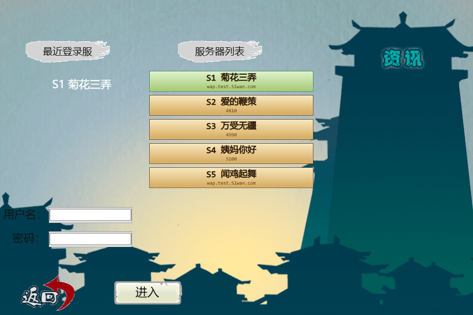
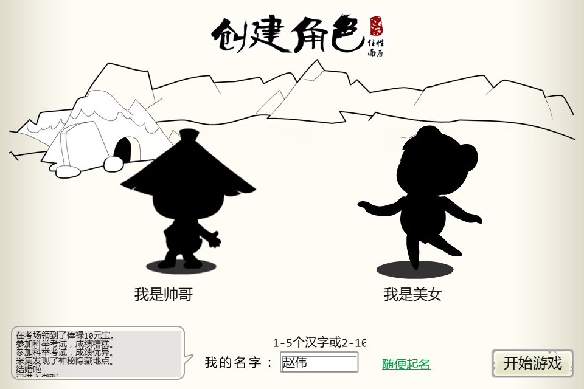
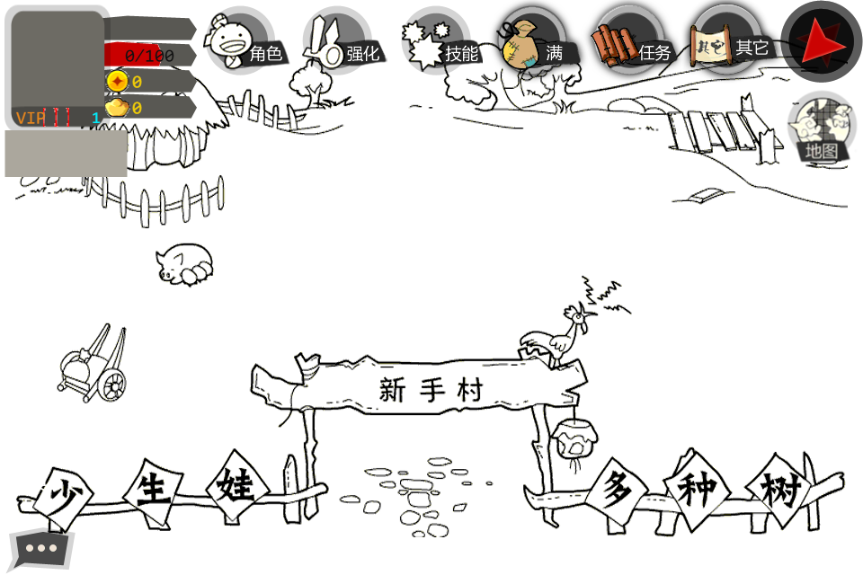
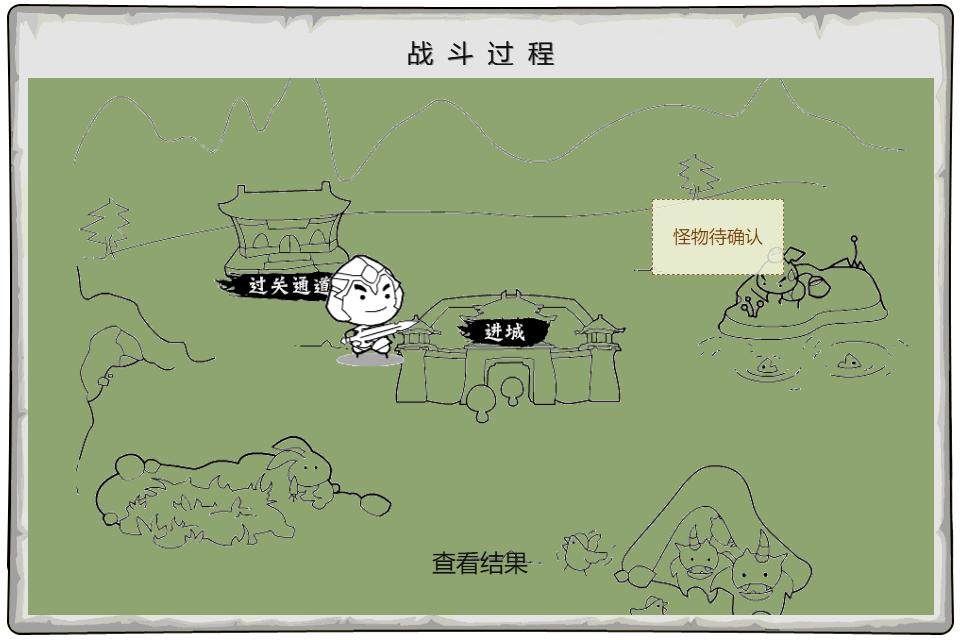

# 大明浮生记 H5

基于安卓《大明浮生记》客户端资源整理的 H5 离线可玩版本。当前仓库只保留浏览器运行所需文件，不包含 APK 原包、解包研究目录、反汇编资料、审计脚本和后端工程。

## 快速体验

本地直接打开：

```text
index.html?play=rookie&chrome=0
```

也可以用任意静态服务器托管本目录后访问同一路径。例如：

```powershell
python -m http.server 8765
```

然后打开：

```text
http://127.0.0.1:8765/index.html?play=rookie&chrome=0
```

如果开启 GitHub Pages，入口通常是：

```text
https://caoyek.github.io/damingfushengji_h5/index.html?play=rookie&chrome=0
```

## 游戏画面

### 登录选服



### 创建角色



### 新手村



### 战斗界面



## 玩家流程

1. 进入 `index.html?play=rookie&chrome=0`。
2. 在登录/选服界面选择服务器。
3. 点击进入本地离线创角流程。
4. 创建角色后进入新手引导。
5. 按引导获得并穿戴新手装备。
6. 进入过关通道，打开 `DungeonTeam -> Battle -> BattleEnd` 战斗链路。
7. 后续可体验部分地图、转职、武将招募和仓库页面。

这个版本是离线 H5 体验，不连接原服务器，也不复用原服登录协议。

## 实现流程

本仓库的 H5 包来自原客户端资源的整理结果，流程如下：

1. 解包安卓客户端资源。
2. 提取 UI XML、PNG、字体、`.fdb` 表、`.ani` 动画定义。
3. 将 UI XML 转成浏览器可渲染的页面数据。
4. 将已确认的本地配置整理成运行时数据。
5. 用原生 HTML/CSS/JavaScript 渲染页面和离线流程。
6. 只把 H5 运行所需文件发布到本仓库。

## 目录说明

```text
.
├── index.html                    # H5 入口
├── styles.css                    # 页面样式
├── renderer.js                   # 页面渲染和可玩流程
├── runtime-state.js              # 浏览器本地运行状态
├── backend-adapter.js            # 可选后端适配；静态运行时不会强制使用
├── reviewed-runtime-resolver.js  # 已审核数据解析辅助
├── data/
│   ├── pages-data.js             # 由原 UI XML 生成的页面数据
│   ├── offline-flows.js          # 离线新手流程数据
│   ├── page-actions.js           # 已确认页面动作
│   ├── runtime-seed.js           # 已确认本地运行时种子
│   └── reviewed-master-data.js   # 已审核外部数据占位
├── assets/                       # 游戏图片和字体资源
├── shared/
│   └── tw-ui-renderer.js         # 共享 UI 渲染器
└── screenshots/                  # README 展示截图
```

## 当前可玩范围

- 登录/选服界面展示。
- 本地离线进入创角。
- 创建角色页面。
- 新手引导主线。
- 新手装备获得和穿戴。
- 过关战斗页面链路。
- 部分地图、转职、招募和仓库壳层。

## 当前边界

以下内容没有写死进 H5 玩法：

- 原服务器鉴权和真实账号数据。
- 怪物队伍、掉落、奖励和完整战斗公式。
- 物品全表、装备属性、强化成本。
- 武将完整属性、品质、费用、技能和刷新权重。
- 任务、邮件、排行、社交等服务器运行时数据。

缺失数据只保留为待确认状态，不凭记忆或猜测补进游戏。

## 项目性质

本项目用于经典游戏界面与玩法流程的非商业保存、学习和复刻研究。仓库中的 H5 包只用于离线展示和体验。
