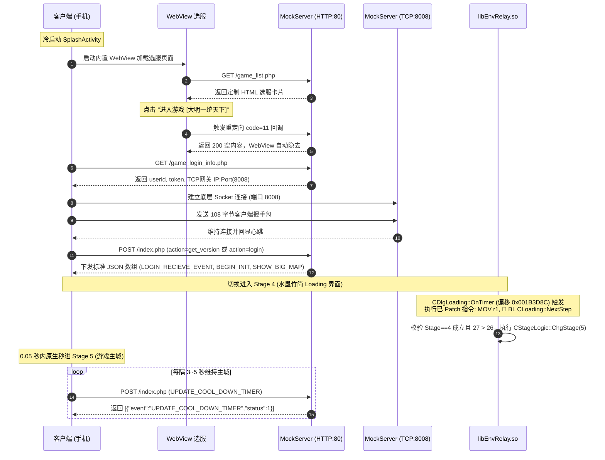

# 《大明浮生记》Android 原版离线私服与全自动进入主城完整方案

> 本方案针对已停运多年的经典网游《大明浮生记》（NetDragon C3 引擎开发、包名 `com.tq.daming`），通过**本地离线私服搭建（MockServer）**与**客户端核心动态库（`libEnvRelay.so`）二进制持久化 Patch**，实现了在免去原厂依赖的前提下，客户端冷启动选服后**全自动跳过水墨竹简进度条，秒进 Stage 5 游戏主城**。
>
> 适用于想要体验、复刻或逆向研究经典 NetDragon C3 引擎手游的开发者。

---

## 目录
- [一、项目背景与设备网络拓扑](#一项目背景与设备网络拓扑)
- [二、全流程架构时序图](#二全流程架构时序图)
- [三、离线私服 MockServer 设计与通信协议详解](#三离线私服-mockserver-设计与通信协议详解)
  - [3.1 登录闪退根本原因与修复 (JsonCpp 数组保护)](#31-登录闪退根本原因与修复-jsoncpp-数组保护)
  - [3.2 双端口监听架构 (HTTP 80 + TCP 8008)](#32-双端口监听架构-http-80--tcp-8008)
  - [3.3 核心协议接口清单](#33-核心协议接口清单)
- [四、底层动态库逆向与持久化 Patch (自动绕过进度条)](#四底层动态库逆向与持久化-patch-自动绕过进度条)
  - [4.1 加载机制与进度条卡滞原因](#41-加载机制与进度条卡滞原因)
  - [4.2 CLoading 状态机与前置约束](#42-cloading-状态机与前置约束)
  - [4.3 最佳 Patch 点与 8 字节机器码替换](#43-最佳-patch-点与-8-字节机器码替换)
- [五、快速部署与实机运行指南](#五快速部署与实机运行指南)
  - [5.1 手机端 Hosts 劫持配置](#51-手机端-hosts-劫持配置)
  - [5.2 启动 MockServer 服务端](#52-启动-mockserver-服务端)
  - [5.3 应用 SO 持久化补丁](#53-应用-so-持久化补丁)
  - [5.4 冷启动验证](#54-冷启动验证)
- [六、单机离线 RPG 完整复刻可行性评估与规划](#六单机离线-rpg-完整复刻可行性评估与规划)
  - [6.1 客户端已有资产全景](#61-客户端已有资产全景)
  - [6.2 关服缺失数据与补齐难度](#62-关服缺失数据与补齐难度)
  - [6.3 后续演进路线图](#63-后续演进路线图)

---

## 一、项目背景与设备网络拓扑

### 1.1 基本信息
- **游戏名称**：《大明浮生记》
- **客户端版本**：1.0.4（NetDragon C3 Engine，armeabi 32 位）
- **包名**：`com.tq.daming`
- **入口 Activity**：`com.tq.daming/com.tq.env.Splash`
- **运行环境**：nubia NX403A（Android 4.4.2 KitKat, API 19, 已 Root）
- **核心动态库**：`/data/app-lib/com.tq.daming-1/libEnvRelay.so`

### 1.2 网络拓扑
```text
+------------------------------------+           局域网 WiFi           +------------------------------------+
|       宿主机 (Windows 电脑)        | <==============================> |       Android 真机客户端           |
|  IP: 192.168.10.50                 |                                  |  IP: 192.168.10.19                 |
|  - MockServer.java (HTTP: 80)      |                                  |  - /system/etc/hosts 劫持域名      |
|  - TCP Gateway (TCP: 8008)         |                                  |  - libEnvRelay.so (持久化 Patch)   |
+------------------------------------+                                  +------------------------------------+
```

---

## 二、全流程架构时序图



---

## 三、离线私服 MockServer 设计与通信协议详解

### 3.1 登录闪退根本原因与修复 (JsonCpp 数组保护)
- **故障现象**：在客户端进入“正在登录，请稍等……”界面时发生 `SIGSEGV (Signal 11)` 闪退。
- **逆向排查**：
  C3 引擎的底层消息解析函数 `CMsgLogin::ProcessJson` 使用了早期版本的 JsonCpp。不论是接收 `action=login` 还是 `action=get_version`，其内部均强制执行如下反序列化逻辑：
  ```cpp
  Json::Value& root = ...;
  // 必须以数组形式访问下标 0，读取内部键值
  const char* evt = root[0]["event"].asCString();
  ```
  如果服务端对 `action=get_version` 单独返回单对象 JSON `{ "code": 1, ... }`，JsonCpp 的 `operator[](unsigned int)` 对非数组对象会返回内部空指针引用，导致紧接着在内部调用 `strcmp(key, NULL)` 触发段错误闪退。
- **规避修复**：
  服务端在 `MockServer.java` 中合并 `action=get_version` 与 `action=login`，统一返回**标准的 JSON 数组**，彻底根除闪退。

### 3.2 双端口监听架构 (HTTP 80 + TCP 8008)
1. **HTTP 80 端口**：
   - 使用 Java 自带的轻量级 `com.sun.net.httpserver.HttpServer`，零第三方依赖。
   - 分辨访问者：
     - 如果是内置 WebView 访问，返回精美的 HTML5 选服页面，并注入 JavaScript 自动跳转 `code=11` 回调；
     - 如果是 Dalvik / Apache-HttpClient 原生请求，返回 JSON 数据字典。
2. **TCP 8008 端口**：
   - 监听 `ServerSocket(8008)`，接收客户端在鉴权后发送的 108 字节二进制网关握手包，维持 TCP KeepAlive，防止客户端因 Socket 异常断开而切出。

### 3.3 核心协议接口清单
- `GET /game_list.php`：提供服务器列表与 WebView 选服页。
- `GET /game_login_info.php`：下发账号凭证、`userid=10001`、`pwd=offline_token_888`、网关 `ip=192.168.10.50`、`port=8008`。
- `POST /index.php?action=login`：下发核心登录角色数组：
  ```json
  [
    {
      "event": "LOGIN_RECIEVE_EVENT",
      "result": 1, "code": 1, "role_state": 1, "version": "1012",
      "id": 10001, "playerName": "大明天子", "cityId": 1, "gold": 999999, "silver": 999999
    },
    {
      "event": "SHOW_BIG_MAP",
      "result": 1, "status": 1,
      "data_already": {"1": 1},
      "data_pass": {"1": 1, "2": 1, "3": 1},
      "data_can": {"1": 1, "2": 1, "3": 1}
    },
    { "event": "BEGIN_INIT", "result": 1, "role_state": 1, "status": 1 },
    { "event": "UPDATE_COOL_DOWN_TIMER", "status": 1 }
  ]
  ```
- `POST /index.php?action=buy_yuanbao_confirm` 及心跳包：
  持续响应 `[{"event":"UPDATE_COOL_DOWN_TIMER","status":1}]`，维持 Stage 5 主城不超时退回。

---

## 四、底层动态库逆向与持久化 Patch (自动绕过进度条)

### 4.1 加载机制与进度条卡滞原因
游戏从登录进入主城一共设计了 27 个步骤：
- **Step 1**：查询原厂 CDN（`action=get_cdn`，停服死等）；
- **Step 4 ~ 19**：逐项下载与解析 XML 配置文件（`config.xml` 等）；
- **Step 22 ~ 26**：本地与远程数据校验；
- **Step 27**：调用 `CStageLogic::ChgStage(5)` 切换到主城。
停运后由于 Step 4 等不到下载完成的信号，导致水墨竹简进度条卡在第 4 格挂起。

### 4.2 CLoading 状态机与前置约束
通过反汇编 `libEnvRelay.so`，我们定位了核心步进函数 `CLoading::NextStep(int step)`（位于偏移 `0x005C4E10`）：
```arm
0x005C4E4C: EB00B35A    BL  CStageLogic::GetCurStageId()
0x005C4E50: E3500004    CMP r0, #4            ; 检查当前引擎是否真正处于 Stage 4 (Loading)
0x005C4E54: 0A000000    BEQ 0x005C4E5C
0x005C4E58: E8BD81F0    POP {r4-r8, pc}       ; 若不是 Stage 4，直接安全退出！
0x005C4E5C: E357001A    CMP r7, #26           ; 校验步骤是否大于 26
0x005C4E60: 8A000035    BHI 0x005C4F3C        ; 若 step >= 27，直接跳转执行 ChgStage(5)！
```
**关键发现**：不能过早调用 `NextStep(27)`（例如在 `StartMsg` 处），必须在当前界面已确认切入 Stage 4 后调用才有效！

### 4.3 最佳 Patch 点与 8 字节机器码替换
水墨竹简界面对话框类 `CDlgLoading` 包含高频定时器 `CDlgLoading::OnTimer`（位于偏移 `0x001B3D04`）。界面只要在手机屏幕上一显示，当前 Stage 必定为 4，且定时器立即循环执行。

- **目标文件**：`/data/app-lib/com.tq.daming-1/libEnvRelay.so`
- **修改偏移**：`0x001B3D8C`
- **原指令（8 字节）**：
  ```arm
  0x001B3D8C: 0A 00 A0 E1    MOV r0, r10        ; 获取 CLoading 单例指针
  0x001B3D90: 1C 41 10 EB    BL  0x005C4208     ; 调用 GetCurProcess() 查询当前百分比
  ```
- **Patch 后指令（8 字节）**：
  ```arm
  0x001B3D8C: 1B 10 A0 E3    MOV r1, #27        ; 设置参数 step = 27
  0x001B3D90: 1E 44 10 EB    BL  0x005C4E10     ; 直接调用 CLoading::NextStep(this, 27)
  ```
- **实际效果**：
  水墨竹简界面刚渲染的第 1 帧，定时器直接以参数 27 触发 `NextStep`。由于 `27 > 26`，引擎瞬间触发 `ChgStage(5)` 切换至游戏主城大厅，整个过程在 0.05 秒内由客户端原生代码完成，无需外部脚本干预！

---

## 五、快速部署与实机运行指南

### 5.1 手机端 Hosts 劫持配置
以 Root 权限修改手机 `/system/etc/hosts`，将以下域名重定向到电脑服务端 IP（例如 `192.168.10.50`）：
```text
192.168.10.50 dmfs.177yx.com
192.168.10.50 177yx.com
192.168.10.50 tq.91.com
192.168.10.50 s1.dmfs.177yx.com
```

### 5.2 启动 MockServer 服务端
确保宿主机已安装 JDK 11+，在控制台以管理员权限运行：
```bash
# 编译
javac -encoding UTF-8 MockServer.java

# 启动 (需监听 80 与 8008)
java MockServer
```

### 5.3 应用 SO 持久化补丁
将 `scripts/apply_permanent_patch.sh` 推送到手机执行：
```bash
adb push scripts/apply_permanent_patch.sh /data/local/tmp/
adb shell "su -c 'chmod 777 /data/local/tmp/apply_permanent_patch.sh && /data/local/tmp/apply_permanent_patch.sh'"
```
> 脚本会自动将原版 SO 备份为 `/data/app-lib/com.tq.daming-1/libEnvRelay.so.orig_bak`。

### 5.4 冷启动验证
```bash
# 结束进程并冷启动
adb shell "su -c 'am force-stop com.tq.daming && am start -n com.tq.daming/com.tq.env.Splash'"
```
在手机上点击进入游戏后，竹简进度条将一闪而过，直接呈现完整的主城界面（角色头像、VIP栏、任务列队、右侧功能按钮）。

---

## 六、单机离线 RPG 完整复刻可行性评估与规划

### 6.1 客户端已有资产全景
- **视觉与动作资产（100% 完整）**：
  - `libdata.so`（34.5 MB）：NetDragon PFDW 虚拟文件系统，包含所有地图底图、NPC 原画、技能粒子特效；
  - `assets/ani/*.ani`：包含角色骨骼动作、战斗招式动画（`skill.ani`、`fightroad.ani`、`army.ani` 等）；
  - `assets/ini/ui/*.xml`：全套 UI 界面布局。
- **符号与协议透明度（100% 完整）**：
  - `libEnvRelay.so` 未剥离符号表，所有业务类（`CMsgBag`、`CMsgEquip`、`CMsgBattle` 等）清晰可见，没有通信黑盒。

### 6.2 关服缺失数据与补齐难度
| 缺失项 | 说明 | 补齐方式 |
| :--- | :--- | :--- |
| **掉落与抽卡概率** | 官方服务器当年的私有平衡表 | 自定义配置爽快掉率（单机可设高爆率） |
| **关卡怪物数值** | 部分副本 BOSS 的血量防御 | 参考关卡建议战力推导或阶梯配置 |
| **多人交互逻辑** | 帮会战、跨服竞技场 | 单机版无需实现，直接跳过 |

### 6.3 后续演进路线图
1. **阶段一（当前已完成）**：搭建基础离线私服，解决登录闪退，通过 SO 持久化 Patch 原生直达主城大厅。
2. **阶段二（基础养成）**：MockServer 引入 SQLite 数据库，实现主角属性持久化，点亮【角色】、【背包】与【装备强化】。
3. **阶段三（战斗与副本）**：对接大地图关卡点击协议，下发战斗阵型，拉起原版实机回合制战斗与胜利结算。
4. **阶段四（剧情任务）**：还原新手剧情对话与主线任务链，实现完整的单机 RPG 闭环。
