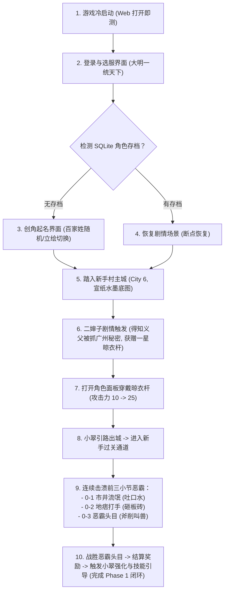

# 《大明浮生记》第一阶段：单机可玩骨干工程开发与验收方案 (Phase 1 Playable Plan)

> **目标版本**：v0.1.0-alpha  
> **核心宗旨**：**“坚决拒绝纸面代码，必须做出端到端可验证的真实可玩版本”**。  
> **交付边界**：从冷启动登录、创角、入驻新手村水墨主城、剧情对话、穿戴装备，到第一场基于原版 GDD-02 数值公式的实机战斗胜利与存档持久化。

---


---

## 核心最高工程铁律：实事求是，区分原版证实事实与复刻基线设计 (Authenticity & Honest Baselining)

> ### 🚨 【项目红线】
> **整个项目的所有核心代码与文档，必须秉承严谨、诚实、实事求是的工程师底线：**  
> 1. **原版提取表优先**：直接从客户端反编译解密提取的 CSV、XML、INI 具有最高权威，任何经过二度整理的策划文档若与原始底表冲突，一律以原始底表为准！  
> 2. **严禁将未证实参数冠以“100% 原版已知”**：服务端未开源的核心数值系数（如防御抵扣常数、等级经验公式曲线），在代码与文档中必须**明确标注为【复刻工程基线设计】**，并在基线 JSON 中保持自洽，坚决杜绝在未证实处宣称“完全等同原版”。

### 1. 通信协议与数据流（对齐 SO 逆向白皮书与原生引导表）
* ❌ **严禁**：脱离原始底表凭空捏造事件，或错误否定原始表原生事件；
* ✅ **必依**：
  * 主线事件驱动必须 100% 严格依照 `extracted_full_resources/server_data/tables_csv/RookieGuideInfo.csv`（其中的 `strToggleEvt` 字段如 `city_dungeon_pk_0_1`、`city_dungeon_pk_0_2`、`city_dungeon_pk_0_3`、`help_member-panel`、`index_member_get_weapon` 为原生核心事件触发器，必须完整实现支持）；
  * 网络交互回包必须遵循 `libEnvRelay.so` 50 个 `CMsg` 规范中的标准 JSON 数组格式（如 `LOGIN_RECIEVE_EVENT`、`SHOW_BATTLE_RESULT`、`SHOW_BIG_MAP`）。

### 2. 界面坐标与排版层级（对齐 348 个 UI XML）
* ❌ **严禁**：在 JS/CSS 中拍脑袋瞎猜按钮坐标、弹窗大小、切图名称或手写样式；
* ✅ **必依**：必须 100% 逐行解析 `extracted_full_resources/client_assets/ui_layouts/*.xml` 原始文件中的 `Rect="X, Y, W, H"`、`Background`、`FontSize` 与节点嵌套书写顺序（Z-Order 层级），保证像素与图层 1:1 绝对吻合。

### 3. 战斗机制与数值推演（对齐 GDD-02 与复刻拟合基线）
* ❌ **严禁**：写死伤害数字（如严禁再出现早期写死的固定扣血 268、固定胜利这种虚假逻辑）；
* ✅ **必依**：
  * 九宫格站位严格读取 `BattlePos.csv`（攻守各 9 阵位像素坐标）；
  * 基础时序以 `BattleSetting.csv` 原始定义为基准（默认动作时间 300、默认技能时间 800、默认帧间隔 100、HP_TIME 400），并在前端表现层配合平滑补间动画；
  * 先手按双方真实速度（`speed`）降序排定；
  * 命中率、暴击率（150%伤害）、防御抵扣计算在服务端推演模拟器中建立规范统一的【复刻工程基线公式】，杜绝随机假数。

### 4. 剧情对话与任务推进（对齐原始 RookieGuideInfo.csv）
* ❌ **严禁**：在 JS 脚本里手写台词字串或臆造流程步骤，严禁混淆场景地理归属；
* ✅ **必依**：
  * 玩家初始所处场景为**【新手村】（City 6）**，剧情为义父被捕至**【广州】（City 8）**，玩家需打通过关通道前往广州；
  * 剧情台词必须直接从 `RookieGuideInfo.csv` 动态驱动，百家姓起名必须从 `CreateRoleInfo.csv` 动态抽取。

### 5. 装备系统数据自洽与属性显式声明
* ❌ **严禁**：只提供数值却缺失加成属性目标的模糊设计；
* ✅ **必依**：装备模板必须显式声明加成目标属性（`target_attr`: `melee`/`defend`/`speed`/`max_hp`），数值成长遵循公式：$$\text{实时属性} = \text{howmuch} + \text{强化等级} \times \text{up\_base}$$。

---

## 一、 第一阶段功能范围与玩家完整体验动线 (Step 1 ~ Step 6 闭环)



### 玩家可玩闭环标准（严格遵循原始主线 Step 1 ~ Step 6）：
1. 玩家在 Chrome/Edge 打开网页，听到古风水墨 BGM，进入【大明一统天下】选服卡片；
2. 点击进入游戏，若首次进入，展现原版男女主角动态呼吸立绘，点击【随机名字】从百家姓库中摇出古风名字；
3. 点击【踏入江湖】完成创角，镜头平滑切入【宣纸水墨新手村（City 6）大底图】；
4. 触发 NPC 剧情对话：二婶子交代身世之谜（义父被锦衣卫抓到广州），并赠送祖传武器【一星晾衣杆】（Item 1002）；
5. 点击右下角【角色】功能按钮，打开角色属性面板，点击武器槽【穿戴】，角色物理攻击力实时从 10 上升为 25；
6. 小翠带路，点击新手村【出城】热区，穿过城门进入【新手城外过关通道】；
7. 依次与过关通道内的敌人展开九宫格回合制战斗：
   * **第 1 战（关卡 0-1 · 市井流氓）**：释放暗界波配合普攻 2 回合击溃，结算获得 40 经验、60 银两、15 战功；
   * **第 2 战（关卡 0-2 · 地痞打手）**：考验武器穿戴，3 回合击溃，掉落【粗麻草鞋】；
   * **第 3 战（关卡 0-3 · 恶霸头目）**：高攻恶霸连击，考验生存，击败后掉落【粗布束带】；
8. 击败恶霸头目后，弹出原版水墨【战斗胜利】结算框（播放 win.ogg），随后自然衔接第 7 步小翠提示台词：“刚才那次战斗有些艰苦！强化装备，提升战斗力，一定能轻松打败它！”，作为第一阶段完美交接点；
9. 任意时刻按 `F5` 刷新浏览器，系统直接读取 SQLite `server/daming.db` **精准恢复当前最新进度与穿戴状态**。

---


## 二、 架构设计与研发路线优化 (Web 优先 + SQLite 权威驱动)

基于“彻底杜绝二次重构、以极速反馈跑通可玩闭环”的最新决策，第一阶段采用 **“Web 优先客户端 + Node.js/SQLite 权威后端”** 的纯正 B/S 架构：

```text
+-----------------------------------------------------------------------------------------------+
|                       【前端表现层：Web 网页端优先 (web/)】 (原生 Canvas 2D)                    |
|  - 视口适配: 960×640 宣纸水墨自适应居中 Contain 算法 (PC 宽屏 / 手机浏览器自适应)              |
|  - 场景驱动: BootScene -> LoginScene -> CreateRoleScene -> MainCityScene -> BattleScene       |
|  - 协议通信: web/src/net/ApiClient.js (通过标准 fetch 调用本地 Node.js 服务接口)              |
|  - 微信兼容: 底层逻辑 100% 纯 JS，Phase 1 在浏览器验证完毕后，半天即可加壳打包至 minigame/      |
+-----------------------------------------------------------------------------------------------+
                                                │
                                                ▼ HTTP POST /api?action=...
+-----------------------------------------------------------------------------------------------+
|                  【后端权威推演与存储中心 (server/)】 (Node.js + better-sqlite3)                |
|  - 权威数据源: 读写 server/daming.db (基于 26 张标准 DDL 与 4 大 baseline 官方配置底表)         |
|  - 业务调度域: 创角鉴权、背包穿装、出战技能装配 (限3个)、主线剧情推进                           |
|  - 战斗推演器: server/src/services/CombatSimulator.js (速度先手、前排索敌、3技能气力判定运算)    |
|  - 极速开发体验: nodemon 监听自动热载，Chrome/Edge F12 控制台毫秒级抓包与断点调试              |
+-----------------------------------------------------------------------------------------------+
```

* **三大核心架构收益**：
  1. **Web 网页端极速自测**：摆脱微信开发者工具的环境限制与域名校验，按 `F12` 即可实时查看网络请求回包，修改代码后 `F5` 刷新即见结果；
  2. **SQLite 单文件原生持久化**：角色经验、背包武器、出战技能、通关战报均写入 `server/daming.db`，开箱即用，免配 MySQL，天然具备 ACID 事务原子性；
  3. **权威推演与展示彻底解耦**：战斗过程 100% 由 `CombatSimulator.js` 瞬时推演生成 `rounds` 战报，前端纯负责音效与动画播放，与未来联网对战架构完全一致。

---

## 三、 第一阶段涉及的具体目录与文件清单

### 3.1 资产引用源（来自 `extracted_full_resources/`）
直接从已有的资产矿藏中按需提取到 `web/assets/` 与后端配置中：

| 资产类型 | 原始绝对路径 | 第一阶段用途 |
| :--- | :--- | :--- |
| **宣纸底图** | `extracted_full_resources/client_assets/images/map/6_cn_xsc.png`<br>`6_cw_xsc.png`<br>`6_ggtd_xsc.png` | 新手村城内全景、新手村城外通道、第一过关通道大地图 |
| **NPC 立绘** | `extracted_full_resources/client_assets/images/npc/6.png`<br>`16.png`<br>`17.png` | 二婶子（送武器）、小翠（带路）、锦衣卫（剧情背景） |
| **创角立绘** | `extracted_full_resources/client_assets/images/roles/male01.png`<br>`famale01.png` | 创角男女主角模型与逐帧动作切图 |
| **UI 切图** | `extracted_full_resources/client_assets/images/ui/dialog_rimbg2.png`<br>`dialog_rimbg4.png`<br>`combtn1.png` | 选服卡片底框、NPC 对话气泡框、确定/关闭按钮 |
| **战斗音频** | `extracted_full_resources/client_assets/audio/bgm/bgm_battle.ogg`<br>`win.ogg` | 战斗全屏背景音乐、胜利通关乐曲 |
| **规则配置** | `extracted_full_resources/server_data/tables_csv/CreateRoleInfo.csv`<br>`BattlePos.csv`<br>`BattleSetting.csv` | 百家姓起名表、战斗左右 9 阵位坐标、动作时序参数 |
| **策划公式** | `extracted_full_resources/docs/GDD/02_战斗机制与数值公式设计.md` | 命中、暴击 150%、格挡 50%、基础伤害公式 |

---

### 3.2 待编写的代码文件清单（分层落地）

#### A. 服务端与存储持久化层（`server/src/`）
1. `db/schema.sql`：Phase 1 核心表结构 DDL（users, roles, inventory, equipments, role_skills, dungeon_monsters, dungeon_stages, dungeon_progress）；
2. `db/index.js`：`better-sqlite3` 数据库连接单例，启用 WAL 模式；
3. `db/init.js`：一键初始化脚本，执行 DDL 并导入 `server/data/baseline/*.json` 种子数据；
4. `services/CombatSimulator.js`：服务端权威战斗推演核心（先手速度排序、前排优先索敌、3技能MP释放与普攻切换、命中/暴击/扣血、生成 `rounds` 战报）；
5. `services/RoleService.js`：创角、属性计算与升级经验模型；
6. `services/EquipService.js`：装备穿戴与属性成长计算（$\text{howmuch} + \text{lv} \times \text{up\_base}$）；
7. `index.js`：Express 路由网关，支持 `action=login`, `action=create_role`, `action=role_info`, `action=equip_item`, `action=city_dungeon_pk`。

#### B. Web 网页端表现层（`web/src/`）
1. `core/CanvasApp.js`：游戏主循环驱动器（60FPS `requestAnimationFrame`），调度 `update(dt)` 与 `render(ctx)`；
2. `core/ViewMatrix.js`：**960×640 虚拟分辨率居中 Contain 等比缩放矩阵**（处理 PC 浏览器与任意手机视口不变形、点击坐标逆映射）；
3. `core/AssetLoader.js`：图片、音频预加载管理器，支持进度条展示；
4. `core/AudioPlayer.js`：Web Audio 音频池管理，支持 BGM 循环与音效并发播放；
5. `net/ApiClient.js`：基于标准 `fetch` 的 HTTP 网络请求客户端，统一处理服务端 JSON 数组响应；
6. `scenes/LoginScene.js`：古风选服页面（水墨卡片【大明一统天下】，点击进入）；
7. `scenes/CreateRoleScene.js`：创角交互（男女主角呼吸立绘切换、百家姓随机起名、点击【踏入大明】）；
8. `scenes/MainCityScene.js`：新手村广州城宣纸全景平铺、二婶子 NPC 对话气泡、底栏功能按钮；
9. `scenes/DungeonScene.js`：城外过关通道大地图、怪物波次点击热区；
10. `scenes/BattleScene.js`：九宫格回合制战斗舞台，严格按服务端 `rounds` 战报播放冲锋、暗界波特效、震屏飘字与结算弹窗；
11. `ui/PlayerInfoDlg.js` / `ui/SkillDlg.js`：角色属性面板（装备穿戴）与技能装配面板（限选 3 技能出战）。


---


---

## 三点五、 核心 UI 布局 XML 映射、控件坐标与前后渲染层级 (Z-Order)

> **核心原则**：**所有 UI 控件的屏幕绝对坐标 (X, Y)、长宽 (W, H)、背景贴图、以及从底到顶的渲染层级，100% 严格依照 `extracted_full_resources/client_assets/ui_layouts/*.xml` 原始定义执行，严禁凭空手搓与盲猜坐标！**

在原版 C3 引擎中，XML 文件内的**节点书写先后顺序，直接决定了界面的绘制层级（后面的节点绘制在前面的节点上方）**。第一阶段涉及的核心 XML 及其控件树全景如下：

### 1. 创角界面布局：`CreateRole.xml`
* **目标文件**：`extracted_full_resources/client_assets/ui_layouts/CreateRole.xml`
* **画布基准**：`960 × 640`
* **控件渲染层级树（从下至上依次绘制）**：
  1. `Dialog` (根容器): `Rect="-480,-320,960,640"`, 基础背景图 `dialog_rimbg8:2` (宣纸古风大底框)
  2. `Image (imgMale)`: `Rect="155, 193, 300, 270"`, 男主角 42 帧呼吸立绘
  3. `Image (imgFemale)`: `Rect="506, 193, 300, 270"`, 女主角 42 帧呼吸立绘
  4. `Static (Static_0)`: `Rect="221, 472, 112, 30"`, 男角色职业/描述文本
  5. `Static (Static_1)`: `Rect="631, 472, 109, 30"`, 女角色职业/描述文本
  6. `Edit (edtRoleName)`: `Rect="464, 586, 122, 26"`, 中文姓名输入框 (LimitText="10")
  7. `Static (staGetNameRand)`: `Rect="601, 551, 135, 58"`, 【随机起名】按钮，文字带下划线，支持点击事件
  8. `Button (btnCreate)`: `Rect="753, 529, 246, 137"`, 【踏入大明】主按钮，背景贴图 `button_combtn1:2`, 文字居中偏下 3px
  9. `Check (chkMale / chkFemale)`: `Rect="144, 176, 279, 331"`, 隐形点击判定框，点击切换男女焦点

### 2. 新手村剧情对话气泡：`RookieNpc.xml`
* **目标文件**：`extracted_full_resources/client_assets/ui_layouts/RookieNpc.xml`
* **属性**：`Modal="1"` (阻断下层点击), `Topmost="1"` (永远置顶)
* **控件渲染层级树（从下至上依次绘制）**：
  1. `Image (Image_0)` (最底层底框): `Rect="200, 134, 540, 360"`, 背景贴图 `dialog_rimbg4:2` (水墨外框)
  2. `Image (Image_1)` (内衬中层): `Rect="224, 207, 495, 262"`, 背景贴图 `dialog_gongge3:4` (浅色宣纸九宫格)
  3. `Image (imgNpc)` (NPC半身立绘): `Rect="171, 124, 217, 329"`, 覆盖在框左侧，绘制二婶子(`npc/6.png`)或小翠(`npc/16.png`)
  4. `Static (Static_0)` (NPC称谓标题): `Rect="393, 170, 158, 27"`, 字体 26px, 文字如【邻居二婶子】
  5. `Static (staNpcTalk)` (NPC主台词): `Rect="395, 221, 310, 75"`, 富文本渲染，自动换行
  6. `Static (staOpContent)` (玩家选择选项): `Rect="395, 317, 310, 64"`, 绿色下划线超链接样式 (`TextColor="ff009c48"`), 点击推进剧情
  7. `Static (staGetContent)` (获得道具通知): `Rect="395, 404, 310, 49"`, 如展示“获得装备：一星晾衣杆”

### 3. 主界面外壳与底栏功能：`Shell.xml`
* **目标文件**：`extracted_full_resources/client_assets/ui_layouts/Shell.xml`
* **控件渲染层级树**：
  1. 左上角玩家头像框 (`head_icon`) 与 VIP 等级铭牌
  2. 右下角功能操作栏 (`pnlBtn`): 包含【角色】、【强化】、【技能】、【背包】四个图标
  3. 顶层快捷地图按钮: 点击弹出世界大地图切换

### 4. 角色属性面板：`PlayerInfo.xml`
* **目标文件**：`extracted_full_resources/client_assets/ui_layouts/PlayerInfo.xml`
* **控件排版**：
  1. 武器槽 (`slot_weapon`): 坐标对应原始槽位，未穿戴显示虚影，穿戴后显示 `1002 晾衣杆` 图标；
  2. 物理攻击文本框 (`staPhyAtk`): 初始为 10，穿戴武器后动态更新为 25；
  3. 关闭按钮 (`btnClose`): 右上角 `(600, 80)` 点击关闭弹窗。

### 5. 战斗结算弹窗：`BattleEnd.xml`
* **目标文件**：`extracted_full_resources/client_assets/ui_layouts/BattleEnd.xml`
* **控件渲染层级树**：
  1. 全屏半透明黑色遮罩 (`rgba(0, 0, 0, 0.6)`)
  2. 弹窗背景板: `dialog_rimbg2.png` 居中显示
  3. 胜利毛笔书法横幅: 【大获全胜】
  4. 奖励列表: 首战获得 银两 `+60`，经验 `+40`，战功 `+15`，50% 概率掉落【粗布麻衣】
  5. 确定按钮: 点击关闭结算并返回大地图通道


### 6. 装备生成、下发与属性模型 (对齐 Baseline 种子数据与 SO 原生协议)

在第一阶段中，装备数据由服务端 SQLite `equip_templates` 与 `equipments` 表驱动下发，显式声明目标加成属性：

#### A. 装备标准 JSON 结构
```json
{
  "item_id": 1002,
  "item_name": "一星晾衣杆",
  "slot_type": "weapon",
  "target_attr": "melee",
  "level": 1,
  "wuzhong_limit": 1000,
  "shuxing_att": 15,
  "shuxing_def": 0,
  "howmuch": 15,
  "is_baifenbi": 0,
  "up_base": 5,
  "weapon_effect": "二婶子赠送的祖传晾衣杆，市井混混防身必备",
  "price": 100
}
```

#### B. 属性与强化计算公式
* 实时装备属性加成：
  $$\text{实时属性加成} = \text{howmuch} + \text{强化等级} \times \text{up\_base}$$
* 装备穿戴直接将对应数值累加至角色的十维核心属性矩阵（`melee`, `defend`, `speed`, `max_hp`），并在战斗中实时参与伤害结算。

#### C. 第一阶段基础装备配置清单 (1-10级，已与 Baseline JSON 严格对齐)
1. **武器**：`1002` 【一星晾衣杆】（槽位 `weapon`, 目标 `melee` +15, 成长步进 `up_base=5`, 混混专属）；
2. **衣服**：`1001` 【粗布麻衣】（槽位 `armor`, 目标 `defend` +8, 成长步进 `up_base=3`, 全通用）；
3. **鞋子**：`1003` 【粗麻草鞋】（槽位 `foot`, 目标 `speed` +5, 成长步进 `up_base=2`, 全通用）；
4. **腰带**：`1004` 【粗布束带】（槽位 `waist`, 目标 `max_hp` +50, 成长步进 `up_base=12`, 全通用）。

---

### 7. 怪物属性建模与新手首批敌人配置规范 (新手村城外过关通道 0-1 ~ 0-3)

原版怪物的具体血量与数值在服务端未开源，我们建立了一套科学、自洽且严格同构的**【复刻工程基线数据源】**（见 `server/data/baseline/monster_templates.json`）。怪物的十维属性模型与玩家角色 100% 同构：

#### A. 怪物数据契约结构 (Monster Baseline Contract)
```json
{
  "monster_id": 9001,
  "name": "市井流氓",
  "level": 1,
  "caty": 1000,
  "swf": "flashs/assets/players/1000_dz_b_nan.swf",
  "max_hp": 100,
  "mp": 20,
  "shuxing": {
    "melee": 12,
    "magic": 0,
    "defend": 4,
    "magic_def": 2,
    "speed": 8,
    "hit": 95,
    "dodge": 5,
    "cri": 5
  },
  "used_skills": [ 1002 ]
}
```

#### B. 第一阶段新手村城外过关通道 0-1 ~ 0-3 怪物阶梯配置表
严格锚定玩家 1-3 级战斗力（未强化晾衣杆物攻 15、强化后物攻 25~30）：
1. **关卡 0-1（主线第4步）· 市井流氓**：
   - 怪物 ID：9001 | 等级：1级 | 门派：混混 (1000) | 生命：100 | 物攻：12 | 物防：4 | 速度：8
   - 配置技能：【吐口水】(ID: 1002，市井挑衅削弱怒气)
   - 战斗体验：纯新手试刀靶子，玩家释放【暗界波】配合普攻 2 回合必胜，怪物打玩家掉约 8~10 点血，给予爽快正向反馈。
2. **关卡 0-2（主线第5步）· 地痞打手**：
   - 怪物 ID：9002 | 等级：2级 | 门派：混混 (1000) | 生命：160 | 物攻：18 | 物防：7 | 速度：10
   - 配置技能：【砸板砖】(ID: 1004，单体物理重击)
   - 战斗体验：考验玩家是否正确穿戴【一星晾衣杆】，3 回合击杀，掉落【粗麻草鞋】提升速度。
3. **关卡 0-3（主线第6步）· 恶霸头目**：
   - 怪物 ID：9003 | 等级：3级 | 门派：攻将 (1001) | 生命：260 | 物攻：28 | 物防：12 | 速度：12
   - 配置技能：【斧削叫兽】(ID: 1011，攻将强力破甲重劈)
   - 战斗体验：高攻破甲怪，玩家单挑感到明显压力与掉血，战后自然引出第 7 步小翠对话：“刚才那次战斗有些艰苦！快去强化装备和升级技能！”。

---

### 8. 服务端权威战斗推演状态机实现规范 (CombatSimulator.js)

战斗推演 100% 在 `server/src/services/CombatSimulator.js` 中瞬时完成，前端仅作为动画与音效播放器：

1. **输入参数**：
   - `attacker_team`：攻方阵容（阵位 `att1~6`、属性快照、已装配的 3 个 `used_skills`）；
   - `defender_team`：守方阵容（阵位 `def1~6`、怪物属性、已装配的 1~3 个技能）；
2. **推演规则**：
   - 每回合全场按 `Speed` 倒序构建行动序列；
   - 嘲讽拦截判定：若防将释放了【嘿孙子】且在持续期内，强制所有单体技能攻击该防将；
   - 技能/普攻分支：扫描 3 个出战技能，MP 充足则释放绝招并扣除 MP，否则打出普攻；
   - 攻防公式与概率骰点：计算命中/闪避（`is_dodge=1`）、暴击 150%（`is_cri=1` 与 `is_shock=1`）、格挡减半 50% 与反击；
3. **输出协议契约**：
   - 输出符合《服务端数据与战斗推演规范白皮书》5.5 节契约标准的 `rounds` JSON 战报，前端播放器读取播放，彻底实现前后端职责纯正分离。

## 四、 阶段交付验收与测试方案 (Definition of Done)

只有通过以下 **10 项严格测试**，第一阶段才算真正验收合格，确保“能玩、可玩、不卡死”：

| 测试用例编号 | 模块 / 环节 | 操作与触发动作 | 预期可玩表现 (Pass 标准) | 验收状态 |
| :--- | :--- | :--- | :--- | :--- |
| **TC-01** | **启动与视口适配** | 在 Chrome/Edge 浏览器（或 F12 切换手机模拟）中打开 `web/index.html` | 画面永远保持 960×640 等比居中，两侧水墨宣纸纹理铺满，无拉伸变形。 | 待测试 |
| **TC-02** | **登录选服** | 点击【进入游戏 [大明一统天下]】按钮 | 播放点击音效，平滑路由至创角（无存档）或新手村（读取 SQLite 存档）。 | 待测试 |
| **TC-03** | **创角立绘切换** | 在创角界面点击【女角色】/【男角色】 | 立绘即时切换为对应性别模型，并持续播放待机动作。 | 待测试 |
| **TC-04** | **百家姓随机起名** | 点击【随机名字】按钮 5 次以上 | 每次从 `CreateRoleInfo.csv` 组合出合法中文名字（如“朱啸天”、“徐破虏”）。 | 待测试 |
| **TC-05** | **空名拦截** | 清空输入框名字，点击【踏入大明】 | 系统弹出气泡提示“名字不能为空”，阻止进入下一步。 | 待测试 |
| **TC-06** | **新手村与二婶子** | 创角完成后踏入 6 号新手村（City 6） | 屏幕展现 6 号新手村全景底图，自动弹出二婶子对话，交代身世并赠送祖传武器【一星晾衣杆】。 | 待测试 |
| **TC-07** | **装备穿戴与属性** | 对话结束获得【一星晾衣杆】，点击【角色】并穿戴 | 晾衣杆从背包移至武器槽，通过接口同步，角色攻击力从 10 实时刷新为 25。 | 待测试 |
| **TC-08** | **通道前两战推进** | 小翠引路出城进入通道，依次打 0-1 流氓与 0-2 打手 | 0-1 战胜获得经验 40、银两 60、战功 15；0-2 战胜获得粗麻草鞋，属性与血量实时扣除与恢复正常。 | 待测试 |
| **TC-09** | **恶霸决战与引导** | 挑战 0-3 恶霸头目，战胜后弹出胜利弹窗 | 播放 `win.ogg`，结算掉落粗布束带，关闭结算后自动触发小翠第 7 步台词（“刚才那次战斗有些艰苦！快去强化装备和升级技能！”）。 | 待测试 |
| **TC-10** | **中断恢复与持久化** | 打完任意关卡后按 `F5` 刷新浏览器 | 重新进入自动读取 SQLite `server/daming.db` 恢复最新关卡进度、背包与穿戴属性，杜绝回档。 | 待测试 |


---

## 五、 后续演进预留接缝 (Phase 2 接口预备)

第一阶段在 Web 端跑通后，系统已具备纯正标准的现代化架构底座：
1. **微信小游戏轻量无缝打包**：由于前端采用纯原生 Canvas 2D 与标准 JS 逻辑，只需将 `web/` 代码注入微信小游戏运行环境（将 canvas 创建改为 `wx.createCanvas`，请求改为 `wx.request`），半天即可在微信开发者工具中一键生成小游戏版本；
2. **向多关卡与多怪物演进**：关卡推进只需在 `server/data/baseline/dungeon_stages.json` 与 SQLite 中追加新关卡与怪物配置，无需修改任何核心代码；
3. **向多人联机平滑演进**：后端引入 WebSocket 模块开放 8008 端口，挂接世界聊天与跑马灯大喇叭广播；数据库将来若需上云，DDL 直接迁移至 MySQL，业务代码零改动。

