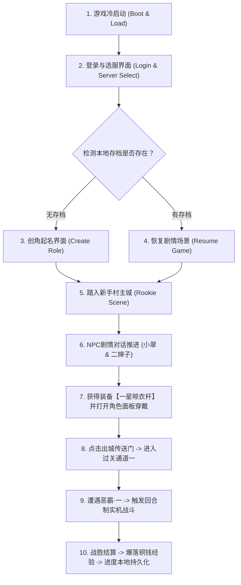

# 《大明浮生记》第一阶段：单机可玩骨干工程开发与验收方案 (Phase 1 Playable Plan)

> **目标版本**：v0.1.0-alpha  
> **核心宗旨**：**“坚决拒绝纸面代码，必须做出端到端可验证的真实可玩版本”**。  
> **交付边界**：从冷启动登录、创角、入驻新手村水墨主城、剧情对话、穿戴装备，到第一场基于原版 GDD-02 数值公式的实机战斗胜利与存档持久化。

---


---

## 核心最高工程铁律：严禁盲猜与写死，100% 基于真实逻辑与资产 (Zero-Guesswork & Zero-Hardcode)

> ### 🚨 【项目红线】
> **整个项目的所有核心代码，严禁任何人凭借主观猜测、或者为了“先把画面跑起来”而采取硬编码写死（Hardcode / Fake Mock / Fixture）！**  
> **所有的数据结构、协议封包、界面坐标、战斗公式与剧情台词，必须 100% 严格基于项目内已提取解密的真实底层资产与官方策划文档！**

### 1. 通信协议与数据流（对齐 SO 逆向白皮书）
* ❌ **严禁**：私自捏造怪异事件名（如严禁再出现早期手搓的 `toggleEvt: "city_dungeon_pk_0_1"`、`help_member-panel` 等假字符串）；
* ✅ **必依**：必须 100% 严格遵照 [docs/libEnvRelay_so_protocol_specification.md](libEnvRelay_so_protocol_specification.md) 中的 50 个 `CMsg` 真实网络动作与标准 JSON 数组回包（如 `CMsgBattle::SendPKMemberId`、`LOGIN_RECIEVE_EVENT`、`SHOW_BATTLE_RESULT`、`SHOW_BIG_MAP`）。

### 2. 界面坐标与排版层级（对齐 348 个 UI XML）
* ❌ **严禁**：在 JS/CSS 中拍脑袋瞎猜按钮坐标、弹窗大小、切图名称或手写样式；
* ✅ **必依**：必须 100% 逐行解析 `extracted_full_resources/client_assets/ui_layouts/*.xml` 原始文件中的 `Rect="X, Y, W, H"`、`Background`、`FontSize` 与节点嵌套书写顺序（Z-Order 层级），保证像素与图层 1:1 绝对吻合。

### 3. 战斗机制与伤害演算（对齐 GDD-02 官方策划案）
* ❌ **严禁**：写死伤害数字（如严禁再出现早期写死的固定扣血 268、固定胜利这种虚假逻辑）；
* ✅ **必依**：必须 100% 按照 `extracted_full_resources/docs/GDD/02_战斗机制与数值公式设计.md` 编写通用的战斗公式引擎：
  * 先手顺序按双方真实 `Speed` 排序；
  * 命中率、暴击率（150%伤害）、格挡率（50%减伤）走真实动态概率骰子；
  * 伤害必须根据双方当前的 `攻击力 - 防御力抵扣` 进行真实浮动演算；
  * 阵位严格读取 `BattlePos.csv`，时序严格依照 `BattleSetting.csv`（入场 300ms、出招 800ms、击退 400ms、暴击震屏 60ms）。

### 4. 剧情对话与任务推进（对齐 31 张官方配置表）
* ❌ **严禁**：在 JS 脚本里手写台词字串或臆造流程步骤；
* ✅ **必依**：必须直接从 `extracted_full_resources/server_data/tables_csv/RookieGuideInfo.csv` 动态驱动台词气泡展示与奖励发放；随机起名必须从 `CreateRoleInfo.csv` 动态抽取。

### 5. 装备、物品与数值成长（对齐 GDD-01 / GDD-03）
* ❌ **严禁**：在代码里针对某件装备（如 1002 晾衣杆）编写专有的 `if (id === 1002)` 特殊逻辑；
* ✅ **必依**：必须建立通用的装备词条与穿戴插槽系统，任何装备的数值加成均统一通过公式折算进角色的四维属性矩阵。

## 一、 第一阶段功能范围与玩家完整体验动线



### 玩家可玩闭环标准（100% 达成体验）：
1. 玩家打开游戏，听到古风水墨 BGM，进入【大明一统天下】选服卡片；
2. 点击进入游戏，若首次进入，展现原版男女主角动态呼吸立绘（42 帧），点击【随机名字】从百家姓库中摇出古风名字；
3. 点击【踏入江湖】完成创角，镜头平滑切入【宣纸水墨新手村大底图】；
4. 触发 NPC 剧情对话：二婶子交代身世之谜，并赠送祖传武器【一星晾衣杆】；
5. 点击右下角【角色】功能按钮，打开角色属性面板，点击武器槽【穿戴】，角色物理攻击力实时从 10 上升为 25；
6. 点击新手村【出城】热区，穿过城门进入【第一过关通道】；
7. 地图上出现首个敌人【恶霸·一】，点击拔刀开战，切入【战斗场景】：
   * 严格按照 GDD-02 时序：双方入场移动 300ms -> 玩家拔刀冲锋 800ms -> 击中恶霸震颤 400ms 并飘出红色伤害扣血字样 -> 恶霸血条归零淡出死亡；
8. 弹出原版水墨【战斗胜利】结算框（播放 win.ogg），发放 50 经验与 100 银两；
9. 关闭结算回到通道，此时强制关闭或刷新游戏，重新打开时**能精准恢复在打完第一关的状态**。

---

## 二、 架构设计与多人可拓展性预留

为了满足“前期纯单机，后期无缝切换多人”的硬性要求，第一阶段采用 **“双模适配器驱动模式（Dual-Mode Adapter）”**：

```text
+-----------------------------------------------------------------------------------------------+
|                                展现层 (Canvas Game Engine)                                    |
|              (Scenes: BootScene, LoginScene, CreateRoleScene, MainCityScene, BattleScene)      |
+-----------------------------------------------------------------------------------------------+
                                               |
                                               v
+-----------------------------------------------------------------------------------------------+
|                          网络与业务抽象层 (GameNetworkClient)                                 |
|                       统一调用: client.send("action_login", payload)                          |
+-----------------------------------------------------------------------------------------------+
                                               |
                     +-------------------------+-------------------------+
                     | (ONLINE_MODE = false)                             | (ONLINE_MODE = true)
                     v                                                   v
+------------------------------------------+    +-----------------------------------------------+
|       【前期】本地单机服务 (LocalEngine)   |    |         【后期】远程服务器 (Node.js Server)   |
|   - 运行在浏览器/小游戏本地 JS 内存中    |    |   - 位于 server/src/routes/                   |
|   - 纯本地计算战斗、四维属性、背包扣减   |    |   - 读写 server/daming.db (SQLite 数据库)     |
|   - 读写 LocalStorage / wx.storage 存档  |    |   - 跨端支持多人联机与排行榜                  |
+------------------------------------------+    +-----------------------------------------------+
```

* **可拓展性保证**：
  * 前端 `GameNetworkClient` 严格模拟原版 `POST /index.php?action=...` 的 JSON 数组返回格式；
  * 本地引擎 `LocalEngine.js` 内部编写的战斗公式、装备穿戴逻辑，与 `server/` 后端服务的代码**完全同构**；
  * 后期开放多人时，只需要把配置开关改为 `ONLINE_MODE: true`，前端无需变动任何一行业务逻辑。

---

## 三、 第一阶段涉及的具体目录与文件清单

### 3.1 资产引用源（来自 `extracted_full_resources/`）
直接从已有的资产矿藏中按需提取到工程中：

| 资产类型 | 原始绝对路径 | 第一阶段用途 |
| :--- | :--- | :--- |
| **宣纸底图** | `extracted_full_resources/client_assets/images/map/6_cn_xsc.png`<br>`6_cw_xsc.png`<br>`6_ggtd_xsc.png` | 新手村城内全景、新手村城外通道、第一过关通道大地图 |
| **NPC 立绘** | `extracted_full_resources/client_assets/images/npc/6.png`<br>`16.png`<br>`17.png` | 二婶子（送武器）、小翠（带路）、锦衣卫（剧情背景） |
| **创角立绘** | `extracted_full_resources/client_assets/images/roles/male01.png`<br>`famale01.png` | 创角男女主角模型与逐帧动作切图 |
| **UI 切图** | `extracted_full_resources/client_assets/images/ui/dialog_rimbg2.png`<br>`dialog_rimbg4.png`<br>`combtn1.png` | 选服卡片底框、NPC 对话气泡框、确定/关闭按钮 |
| **战斗音频** | `extracted_full_resources/client_assets/audio/bgm/bgm_battle.ogg`<br>`win.ogg` | 战斗全屏背景音乐、胜利通关乐曲 |
| **规则配置** | `extracted_full_resources/server_data/tables_csv/CreateRoleInfo.csv`<br>`BattlePos.csv`<br>`BattleSetting.csv` | 百家姓起名表、战斗左右 9 阵位坐标、动作时序参数 |
| **策划公式** | `extracted_full_resources/docs/GDD/02_战斗机制与数值公式设计.md` | 命中、暴击 150%、格挡 50%、基础伤害公式 |

---

### 3.2 待编写的代码文件清单（以 `web/` 与 `minigame/` 共享核心为例）

我们将第一阶段代码构建在 `web/`（便于双击即测）以及 `minigame/`（便于微信导入），两者共享核心纯 JS 逻辑：

#### A. 核心引擎与基础设施（`src/core/`）
1. `CanvasApp.js`：游戏主循环驱动器（60FPS `requestAnimationFrame`），调度 `update(dt)` 与 `render(ctx)`；
2. `ViewMatrix.js`：**960×640 虚拟分辨率居中 Contain 等比缩放矩阵**（处理任意手机屏幕不拉伸与点击坐标映射）；
3. `AssetLoader.js`：异步图片与音频预加载管理器，支持进度条展示；
4. `AudioPlayer.js`：背景音乐循环播放与音效并发池（兼容 Web Audio 与微信 InnerAudioContext）；
5. `SaveManager.js`：本地存档管理器（存取 `daming_save_v1` JSON 结构体）。

#### B. 本地离线业务内核（`src/engine/`，预留后期同构至 `server/`）
1. `LocalGameEngine.js`：模拟服务端核心路由分发器，处理 `action=login`、`action=role`、`action=battle`；
2. `BattleSimulator.js`：**纯单机战斗演算核心**：
   * 输入：玩家攻防血量 + 怪物攻防血量；
   * 运算：基于 GDD-02 公式计算每回合命中、暴击、受击扣血；
   * 输出：标准的 `SHOW_BATTLE_RESULT` JSON 战报数组。
3. `ItemSystem.js`：道具与装备穿戴逻辑（背包物品移入装备槽，属性动态加成）。

#### C. 游戏场景表现层（`src/scenes/`）
1. `LoginScene.js`：古风选服页面（水墨卡片【大明一统天下】，点击进入）；
2. `CreateRoleScene.js`：创角交互（男女主角动画切换、随机摇号起名、点击【踏入大明】）；
3. `MainCityScene.js`：新手村宣纸大地图平铺、NPC 剧情对话气泡浮现、功能栏【角色】面板弹窗；
4. `DungeonScene.js`：城外过关通道一推图场景、怪物点击热区高亮；
5. `BattleScene.js`：回合制战斗舞台，执行战报回放（玩家冲锋、受击震颤漂字、倒地淡出、胜利结算弹窗）。

---


---

## 三点五、 核心 UI 布局 XML 映射、控件坐标与前后渲染层级 (Z-Order)

> **核心原则**：**所有 UI 控件的屏幕绝对坐标 (X, Y)、长宽 (W, H)、背景贴图、以及从底到顶的渲染层级，100% 严格依照 `extracted_full_resources/client_assets/ui_layouts/*.xml` 原始定义执行，严禁凭空手搓与盲猜坐标！**

在原版 C3 引擎中，XML 文件内的**节点书写先后顺序，直接决定了界面的绘制层级（后面的节点绘制在前面的节点上方）**。第一阶段涉及的核心 XML 及其控件树全景如下：

### 1. 创角界面布局：`CreateRole.xml`
* **目标文件**：`extracted_full_resources/client_assets/ui_layouts/CreateRole.xml`
* **画布基准**：`960 × 640`
* **控件渲染层级树（从下至上依次绘制）**：
  1. `Dialog` (根容器): `Rect="-480,-320,960,640"`, 基础背景图 `dialog_rimbg8:2` (宣纸古风大底框)
  2. `Image (imgMale)`: `Rect="155, 193, 300, 270"`, 男主角 42 帧呼吸立绘
  3. `Image (imgFemale)`: `Rect="506, 193, 300, 270"`, 女主角 42 帧呼吸立绘
  4. `Static (Static_0)`: `Rect="221, 472, 112, 30"`, 男角色职业/描述文本
  5. `Static (Static_1)`: `Rect="631, 472, 109, 30"`, 女角色职业/描述文本
  6. `Edit (edtRoleName)`: `Rect="464, 586, 122, 26"`, 中文姓名输入框 (LimitText="10")
  7. `Static (staGetNameRand)`: `Rect="601, 551, 135, 58"`, 【随机起名】按钮，文字带下划线，支持点击事件
  8. `Button (btnCreate)`: `Rect="753, 529, 246, 137"`, 【踏入大明】主按钮，背景贴图 `button_combtn1:2`, 文字居中偏下 3px
  9. `Check (chkMale / chkFemale)`: `Rect="144, 176, 279, 331"`, 隐形点击判定框，点击切换男女焦点

### 2. 新手村剧情对话气泡：`RookieNpc.xml`
* **目标文件**：`extracted_full_resources/client_assets/ui_layouts/RookieNpc.xml`
* **属性**：`Modal="1"` (阻断下层点击), `Topmost="1"` (永远置顶)
* **控件渲染层级树（从下至上依次绘制）**：
  1. `Image (Image_0)` (最底层底框): `Rect="200, 134, 540, 360"`, 背景贴图 `dialog_rimbg4:2` (水墨外框)
  2. `Image (Image_1)` (内衬中层): `Rect="224, 207, 495, 262"`, 背景贴图 `dialog_gongge3:4` (浅色宣纸九宫格)
  3. `Image (imgNpc)` (NPC半身立绘): `Rect="171, 124, 217, 329"`, 覆盖在框左侧，绘制二婶子(`npc/6.png`)或小翠(`npc/16.png`)
  4. `Static (Static_0)` (NPC称谓标题): `Rect="393, 170, 158, 27"`, 字体 26px, 文字如【邻居二婶子】
  5. `Static (staNpcTalk)` (NPC主台词): `Rect="395, 221, 310, 75"`, 富文本渲染，自动换行
  6. `Static (staOpContent)` (玩家选择选项): `Rect="395, 317, 310, 64"`, 绿色下划线超链接样式 (`TextColor="ff009c48"`), 点击推进剧情
  7. `Static (staGetContent)` (获得道具通知): `Rect="395, 404, 310, 49"`, 如展示“获得装备：一星晾衣杆”

### 3. 主界面外壳与底栏功能：`Shell.xml`
* **目标文件**：`extracted_full_resources/client_assets/ui_layouts/Shell.xml`
* **控件渲染层级树**：
  1. 左上角玩家头像框 (`head_icon`) 与 VIP 等级铭牌
  2. 右下角功能操作栏 (`pnlBtn`): 包含【角色】、【强化】、【技能】、【背包】四个图标
  3. 顶层快捷地图按钮: 点击弹出世界大地图切换

### 4. 角色属性面板：`PlayerInfo.xml`
* **目标文件**：`extracted_full_resources/client_assets/ui_layouts/PlayerInfo.xml`
* **控件排版**：
  1. 武器槽 (`slot_weapon`): 坐标对应原始槽位，未穿戴显示虚影，穿戴后显示 `1002 晾衣杆` 图标；
  2. 物理攻击文本框 (`staPhyAtk`): 初始为 10，穿戴武器后动态更新为 25；
  3. 关闭按钮 (`btnClose`): 右上角 `(600, 80)` 点击关闭弹窗。

### 5. 战斗结算弹窗：`BattleEnd.xml`
* **目标文件**：`extracted_full_resources/client_assets/ui_layouts/BattleEnd.xml`
* **控件渲染层级树**：
  1. 全屏半透明黑色遮罩 (`rgba(0, 0, 0, 0.6)`)
  2. 弹窗背景板: `dialog_rimbg2.png` 居中显示
  3. 胜利毛笔书法横幅: 【大获全胜】
  4. 奖励列表: 银两图标 + `+100`，经验图标 + `+50`
  5. 确定按钮: 点击关闭结算并返回大地图通道


### 6. 装备生成、下发与强化计算规范 (对齐 GDD-03 与 SO 原生协议)

在第一阶段中，装备数据由 `LocalGameEngine.js`（后期同构至 `server/`）按标准原生协议下发，严禁随意手写字段：

#### A. 装备标准 JSON 结构
```json
{
  "item_id": 1002,
  "item_name": "一星晾衣杆",
  "level": 1,
  "wuzhong_limit": 1000,
  "shuxing_att": 15,
  "shuxing_def": 0,
  "howmuch": 15,
  "is_baifenbi": 0,
  "up_base": 5,
  "weapon_effect": "二婶子赠送的祖传晾衣杆，市井混混防身必备",
  "price": 100
}
```

#### B. 属性与强化计算公式
* 实时装备物理攻击：
  $$\text{TotalAtk} = \text{howmuch} + \text{强化等级} \times \text{up\_base}$$
* 装备穿戴直接同步刷新 `RoleInfo` 面板中的 `StaPhyAtk` 与 `StaPhyAtkEquipAdd`，并在战斗中实时参与伤害结算。

#### C. 第一阶段基础装备配置清单 (1-10级)
1. **武器**：`1002` 【一星晾衣杆】（物攻+15, up_base=5, 混混专属）；
2. **衣服**：`1001` 【粗布麻衣】（物防+10, up_base=3, 全通用）；
3. **鞋子**：`1003` 【粗麻草鞋】（速度+8, up_base=2, 全通用）；
4. **腰带**：`1004` 【粗布束带】（生命+60, up_base=15, 全通用）。

---

### 7. 怪物属性建模与新手首批敌人配置规范 (广州新手关卡 0-1 ~ 0-3)

由于原版怪物的属性与技能表存储在服务端数据库中，我们必须为复刻工程建立一套标准的怪物配置源文件（`server/data/dungeon_monsters.json` 与本地同构），怪物的十维属性模型与玩家角色 100% 同构，技能严格从 34 个官方门派技能中挑选：

#### A. 怪物数据契约结构 (Monster Contract)
```json
{
  "monster_id": 9001,
  "name": "市井流氓",
  "level": 1,
  "caty": 1000,
  "swf": "flashs/assets/players/1000_dz_b_nan.swf",
  "max_hp": 100,
  "mp": 20,
  "shuxing": {
    "melee": 12,
    "magic": 0,
    "defend": 4,
    "magic_def": 2,
    "speed": 8,
    "hit": 95,
    "dodge": 5,
    "cri": 5
  },
  "used_skills": [ 1001 ]
}
```

#### B. 第一阶段广州新手过关通道 0-1 ~ 0-3 怪物阶梯配置表
严格锚定玩家 1-3 级战斗力（未强化晾衣杆物攻 15、强化后物攻 25~30）：
1. **关卡 0-1（主线第4步）· 市井流氓**：
   - 等级：1级 | 门派：混混 (1000) | 生命：100 | 物攻：12 | 物防：4 | 速度：8
   - 配置技能：【吐口水】(ID: 1001，市井挑衅削弱怒气)
   - 战斗体验：纯新手试刀靶子，玩家 2 刀必砍死，怪物打玩家掉约 8~10 点血，给予爽快反馈。
2. **关卡 0-2（主线第5步）· 地痞打手**：
   - 等级：2级 | 门派：混混 (1000) | 生命：160 | 物攻：18 | 物防：7 | 速度：10
   - 配置技能：【砸板砖】(ID: 1003，单体物理重击)
   - 战斗体验：考验玩家是否正确穿戴【一星晾衣杆】，3 回合击杀。
3. **关卡 0-3（主线第6步）· 恶霸头目**：
   - 等级：3级 | 门派：攻将 (1001) | 生命：260 | 物攻：28 | 物防：12 | 速度：12
   - 配置技能：【斧削叫兽】(ID: 1016，单体破甲斩杀)
   - 战斗体验：高攻破甲怪，玩家单挑感到明显压力与掉血，战后自然引出第 7 步小翠对话：“刚才那次战斗有些艰苦！快去强化装备和升级技能！”。

---

### 8. 服务端权威战斗推演状态机实现规范 (CombatSimulator 双模引擎)

必须在 `server/src/services/CombatSimulator.js`（以及本地引擎 `src/engine/BattleSimulator.js`）中实现与原版一致的权威推演引擎，前端仅作为播放器：

1. **输入参数**：
   - `attacker_team`：攻方阵容（阵位 `att1~6`、属性快照、已装配的 3 个 `used_skills`）；
   - `defender_team`：守方阵容（阵位 `def1~6`、怪物属性、已装配的 1~3 个技能）；
2. **推演规则**：
   - 每回合全场按 `Speed` 倒序构建行动序列；
   - 嘲讽拦截判定：若防将释放了【嘿，孙子！】且在持续期内，强制所有单体技能攻击该防将；
   - 技能/普攻分支：MP 充足则释放 3 个技能之一并扣除 MP，否则打出普攻；
   - 攻防公式与概率骰点：计算命中/闪避（`shanbi.swf`）、暴击 150%（`baoji.swf` 与 `is_shock=1`）、格挡减半 50% 与反击；
3. **输出协议契约**：
   - 输出与 `libEnvRelay.so` 中 `CBattle::ProcessBattleInfo` 100% 兼容的标准 `rounds` JSON 战报，前端播放器只管读取播放，实现“单机与联网无缝统一”。

## 四、 阶段交付验收与测试方案 (Definition of Done)

只有通过以下 **10 项严格测试**，第一阶段才算真正验收合格，确保“能玩、可玩、不卡死”：

| 测试用例编号 | 模块 / 环节 | 操作与触发动作 | 预期可玩表现 (Pass 标准) | 验收状态 |
| :--- | :--- | :--- | :--- | :--- |
| **TC-01** | **启动与视口适配** | 在不同比例窗口（16:9 PC, 19.5:9 手机）打开 | 画面永远保持 960×640 等比居中，两侧平铺水墨纹理，无拉伸黑边。 | 待测试 |
| **TC-02** | **登录选服** | 点击【进入游戏 [大明一统天下]】按钮 | 按钮点击有音频反馈，平滑路由至创角（无存档）或新手村（有存档）。 | 待测试 |
| **TC-03** | **创角立绘切换** | 在创角界面点击【女角色】/【男角色】 | 立绘即时切换为对应性别模型，并持续播放 42 帧呼吸待机动作。 | 待测试 |
| **TC-04** | **百家姓随机起名** | 点击【随机名字】按钮 5 次以上 | 每次从 `CreateRoleInfo.csv` 组合出合法中文名字（如“朱啸天”、“徐破虏”）。 | 待测试 |
| **TC-05** | **空名拦截** | 清空输入框名字，点击【踏入大明】 | 系统弹出气泡提示“名字不能为空”，阻止进入下一步。 | 待测试 |
| **TC-06** | **新手村与剧情** | 创角完成后进入新手村 | 屏幕展现 6 号新手村宣纸水墨底图，自动弹出二婶子对话，文本正确替换角色名。 | 待测试 |
| **TC-07** | **装备穿戴与属性** | 对话结束获得【一星晾衣杆】，点击【角色】并穿戴 | 晾衣杆图标从背包移至武器槽，攻击力数值从 10 实时刷新为 25。 | 待测试 |
| **TC-08** | **出城过关通道** | 点击新手村城门【出城】热区 | 场景平滑切换为城外过关通道一底图，地图上渲染出怪物【恶霸·一】。 | 待测试 |
| **TC-09** | **实机战斗与公式** | 点击恶霸开启战斗 | 播放 `bgm_battle.ogg`，玩家按 GDD-02 时序冲锋，恶霸根据攻防公式计算真实扣血并飘字震动，恶霸阵亡淡出，弹出胜利弹窗（播放 `win.ogg`）。 | 待测试 |
| **TC-10** | **中断恢复与持久化** | 战斗胜利回到通道后，直接强制关闭网页/杀掉进程重开 | 重新打开游戏后无需重新创角，直接秒进城外通道，角色保持穿戴晾衣杆状态。 | 待测试 |

---

## 五、 后续演进预留接缝 (Phase 2 接口预备)

第一阶段完成后，系统已具备完整的本地运行引擎：
1. **向多关卡演进**：只需在关卡列表追加 `dungeon_id: 2, 3...`，配置不同的怪物血量攻防；
2. **向后端迁移演进**：将 `LocalGameEngine.js` 内部的 `BattleSimulator` 与 `ItemSystem` 直接复制进 `server/src/services/`，并接入 SQLite 存储，即可直接点亮真正的大明私服后端！
