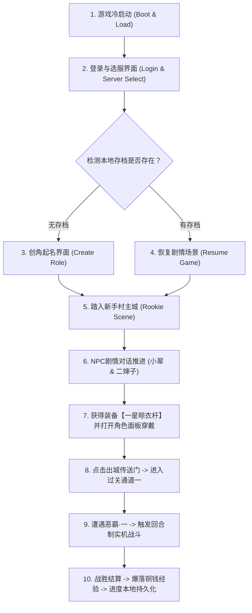

# 《大明浮生记》第一阶段：单机可玩骨干工程开发与验收方案 (Phase 1 Playable Plan)

> **目标版本**：v0.1.0-alpha  
> **核心宗旨**：**“坚决拒绝纸面代码，必须做出端到端可验证的真实可玩版本”**。  
> **交付边界**：从冷启动登录、创角、入驻新手村水墨主城、剧情对话、穿戴装备，到第一场基于原版 GDD-02 数值公式的实机战斗胜利与存档持久化。

---

## 一、 第一阶段功能范围与玩家完整体验动线



### 玩家可玩闭环标准（100% 达成体验）：
1. 玩家打开游戏，听到古风水墨 BGM，进入【大明一统天下】选服卡片；
2. 点击进入游戏，若首次进入，展现原版男女主角动态呼吸立绘（42 帧），点击【随机名字】从百家姓库中摇出古风名字；
3. 点击【踏入江湖】完成创角，镜头平滑切入【宣纸水墨新手村大底图】；
4. 触发 NPC 剧情对话：二婶子交代身世之谜，并赠送祖传武器【一星晾衣杆】；
5. 点击右下角【角色】功能按钮，打开角色属性面板，点击武器槽【穿戴】，角色物理攻击力实时从 10 上升为 25；
6. 点击新手村【出城】热区，穿过城门进入【第一过关通道】；
7. 地图上出现首个敌人【恶霸·一】，点击拔刀开战，切入【战斗场景】：
   * 严格按照 GDD-02 时序：双方入场移动 300ms -> 玩家拔刀冲锋 800ms -> 击中恶霸震颤 400ms 并飘出红色伤害扣血字样 -> 恶霸血条归零淡出死亡；
8. 弹出原版水墨【战斗胜利】结算框（播放 win.ogg），发放 50 经验与 100 银两；
9. 关闭结算回到通道，此时强制关闭或刷新游戏，重新打开时**能精准恢复在打完第一关的状态**。

---

## 二、 架构设计与多人可拓展性预留

为了满足“前期纯单机，后期无缝切换多人”的硬性要求，第一阶段采用 **“双模适配器驱动模式（Dual-Mode Adapter）”**：

```text
+-----------------------------------------------------------------------------------------------+
|                                展现层 (Canvas Game Engine)                                    |
|              (Scenes: BootScene, LoginScene, CreateRoleScene, MainCityScene, BattleScene)      |
+-----------------------------------------------------------------------------------------------+
                                               |
                                               v
+-----------------------------------------------------------------------------------------------+
|                          网络与业务抽象层 (GameNetworkClient)                                 |
|                       统一调用: client.send("action_login", payload)                          |
+-----------------------------------------------------------------------------------------------+
                                               |
                     +-------------------------+-------------------------+
                     | (ONLINE_MODE = false)                             | (ONLINE_MODE = true)
                     v                                                   v
+------------------------------------------+    +-----------------------------------------------+
|       【前期】本地单机服务 (LocalEngine)   |    |         【后期】远程服务器 (Node.js Server)   |
|   - 运行在浏览器/小游戏本地 JS 内存中    |    |   - 位于 server/src/routes/                   |
|   - 纯本地计算战斗、四维属性、背包扣减   |    |   - 读写 server/daming.db (SQLite 数据库)     |
|   - 读写 LocalStorage / wx.storage 存档  |    |   - 跨端支持多人联机与排行榜                  |
+------------------------------------------+    +-----------------------------------------------+
```

* **可拓展性保证**：
  * 前端 `GameNetworkClient` 严格模拟原版 `POST /index.php?action=...` 的 JSON 数组返回格式；
  * 本地引擎 `LocalEngine.js` 内部编写的战斗公式、装备穿戴逻辑，与 `server/` 后端服务的代码**完全同构**；
  * 后期开放多人时，只需要把配置开关改为 `ONLINE_MODE: true`，前端无需变动任何一行业务逻辑。

---

## 三、 第一阶段涉及的具体目录与文件清单

### 3.1 资产引用源（来自 `extracted_full_resources/`）
直接从已有的资产矿藏中按需提取到工程中：

| 资产类型 | 原始绝对路径 | 第一阶段用途 |
| :--- | :--- | :--- |
| **宣纸底图** | `extracted_full_resources/client_assets/images/map/6_cn_xsc.png`<br>`6_cw_xsc.png`<br>`6_ggtd_xsc.png` | 新手村城内全景、新手村城外通道、第一过关通道大地图 |
| **NPC 立绘** | `extracted_full_resources/client_assets/images/npc/6.png`<br>`16.png`<br>`17.png` | 二婶子（送武器）、小翠（带路）、锦衣卫（剧情背景） |
| **创角立绘** | `extracted_full_resources/client_assets/images/roles/male01.png`<br>`famale01.png` | 创角男女主角模型与逐帧动作切图 |
| **UI 切图** | `extracted_full_resources/client_assets/images/ui/dialog_rimbg2.png`<br>`dialog_rimbg4.png`<br>`combtn1.png` | 选服卡片底框、NPC 对话气泡框、确定/关闭按钮 |
| **战斗音频** | `extracted_full_resources/client_assets/audio/bgm/bgm_battle.ogg`<br>`win.ogg` | 战斗全屏背景音乐、胜利通关乐曲 |
| **规则配置** | `extracted_full_resources/server_data/tables_csv/CreateRoleInfo.csv`<br>`BattlePos.csv`<br>`BattleSetting.csv` | 百家姓起名表、战斗左右 9 阵位坐标、动作时序参数 |
| **策划公式** | `extracted_full_resources/docs/GDD/02_战斗机制与数值公式设计.md` | 命中、暴击 150%、格挡 50%、基础伤害公式 |

---

### 3.2 待编写的代码文件清单（以 `web/` 与 `minigame/` 共享核心为例）

我们将第一阶段代码构建在 `web/`（便于双击即测）以及 `minigame/`（便于微信导入），两者共享核心纯 JS 逻辑：

#### A. 核心引擎与基础设施（`src/core/`）
1. `CanvasApp.js`：游戏主循环驱动器（60FPS `requestAnimationFrame`），调度 `update(dt)` 与 `render(ctx)`；
2. `ViewMatrix.js`：**960×640 虚拟分辨率居中 Contain 等比缩放矩阵**（处理任意手机屏幕不拉伸与点击坐标映射）；
3. `AssetLoader.js`：异步图片与音频预加载管理器，支持进度条展示；
4. `AudioPlayer.js`：背景音乐循环播放与音效并发池（兼容 Web Audio 与微信 InnerAudioContext）；
5. `SaveManager.js`：本地存档管理器（存取 `daming_save_v1` JSON 结构体）。

#### B. 本地离线业务内核（`src/engine/`，预留后期同构至 `server/`）
1. `LocalGameEngine.js`：模拟服务端核心路由分发器，处理 `action=login`、`action=role`、`action=battle`；
2. `BattleSimulator.js`：**纯单机战斗演算核心**：
   * 输入：玩家攻防血量 + 怪物攻防血量；
   * 运算：基于 GDD-02 公式计算每回合命中、暴击、受击扣血；
   * 输出：标准的 `SHOW_BATTLE_RESULT` JSON 战报数组。
3. `ItemSystem.js`：道具与装备穿戴逻辑（背包物品移入装备槽，属性动态加成）。

#### C. 游戏场景表现层（`src/scenes/`）
1. `LoginScene.js`：古风选服页面（水墨卡片【大明一统天下】，点击进入）；
2. `CreateRoleScene.js`：创角交互（男女主角动画切换、随机摇号起名、点击【踏入大明】）；
3. `MainCityScene.js`：新手村宣纸大地图平铺、NPC 剧情对话气泡浮现、功能栏【角色】面板弹窗；
4. `DungeonScene.js`：城外过关通道一推图场景、怪物点击热区高亮；
5. `BattleScene.js`：回合制战斗舞台，执行战报回放（玩家冲锋、受击震颤漂字、倒地淡出、胜利结算弹窗）。

---

## 四、 阶段交付验收与测试方案 (Definition of Done)

只有通过以下 **10 项严格测试**，第一阶段才算真正验收合格，确保“能玩、可玩、不卡死”：

| 测试用例编号 | 模块 / 环节 | 操作与触发动作 | 预期可玩表现 (Pass 标准) | 验收状态 |
| :--- | :--- | :--- | :--- | :--- |
| **TC-01** | **启动与视口适配** | 在不同比例窗口（16:9 PC, 19.5:9 手机）打开 | 画面永远保持 960×640 等比居中，两侧平铺水墨纹理，无拉伸黑边。 | 待测试 |
| **TC-02** | **登录选服** | 点击【进入游戏 [大明一统天下]】按钮 | 按钮点击有音频反馈，平滑路由至创角（无存档）或新手村（有存档）。 | 待测试 |
| **TC-03** | **创角立绘切换** | 在创角界面点击【女角色】/【男角色】 | 立绘即时切换为对应性别模型，并持续播放 42 帧呼吸待机动作。 | 待测试 |
| **TC-04** | **百家姓随机起名** | 点击【随机名字】按钮 5 次以上 | 每次从 `CreateRoleInfo.csv` 组合出合法中文名字（如“朱啸天”、“徐破虏”）。 | 待测试 |
| **TC-05** | **空名拦截** | 清空输入框名字，点击【踏入大明】 | 系统弹出气泡提示“名字不能为空”，阻止进入下一步。 | 待测试 |
| **TC-06** | **新手村与剧情** | 创角完成后进入新手村 | 屏幕展现 6 号新手村宣纸水墨底图，自动弹出二婶子对话，文本正确替换角色名。 | 待测试 |
| **TC-07** | **装备穿戴与属性** | 对话结束获得【一星晾衣杆】，点击【角色】并穿戴 | 晾衣杆图标从背包移至武器槽，攻击力数值从 10 实时刷新为 25。 | 待测试 |
| **TC-08** | **出城过关通道** | 点击新手村城门【出城】热区 | 场景平滑切换为城外过关通道一底图，地图上渲染出怪物【恶霸·一】。 | 待测试 |
| **TC-09** | **实机战斗与公式** | 点击恶霸开启战斗 | 播放 `bgm_battle.ogg`，玩家按 GDD-02 时序冲锋，恶霸受击扣血 268 飘字并震动，恶霸阵亡淡出，弹出胜利弹窗（播放 `win.ogg`）。 | 待测试 |
| **TC-10** | **中断恢复与持久化** | 战斗胜利回到通道后，直接强制关闭网页/杀掉进程重开 | 重新打开游戏后无需重新创角，直接秒进城外通道，角色保持穿戴晾衣杆状态。 | 待测试 |

---

## 五、 后续演进预留接缝 (Phase 2 接口预备)

第一阶段完成后，系统已具备完整的本地运行引擎：
1. **向多关卡演进**：只需在关卡列表追加 `dungeon_id: 2, 3...`，配置不同的怪物血量攻防；
2. **向后端迁移演进**：将 `LocalGameEngine.js` 内部的 `BattleSimulator` 与 `ItemSystem` 直接复制进 `server/src/services/`，并接入 SQLite 存储，即可直接点亮真正的大明私服后端！
