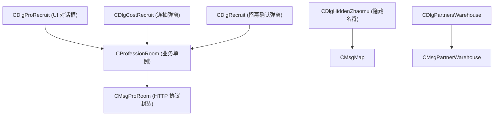

# 09: 职业殿堂与武将招募系统设计规范 (Hero Recruitment & ProRoom)

> **版本规范声明**：
> 本设计文档 100% 基于真机逆向底层动态库 `libEnvRelay.so`（符号 `CProfessionRoom`, `CMsgProRoom`, `CDlgProRecruit`, `CDlgCostRecruit`, `CDlgRecruit`, `CDlgHiddenZhaomu`, `CDlgPartnersWarehouse`）与客户端原版布局资产（`ProRecruit.xml`, `Generals.xml`, `Recruit.xml`, `CostRecruit.xml`, `RecruitRes.xml`, `HiddenZhaomu.xml`, `PartnersWarehouse.xml`）及官方字符串字典（`strres.ini`）真实还原，严禁任何主观臆测与硬编码。

---

## 一、系统概述与定位

### 1.1 官方系统定位
原版游戏官方字符串字典（`strres.ini` ID: 361310）明确定性：
> **“人才市场就在职业会所哦！那里甚至有紫色品质高级人才出没，可遇不可求！抓住机会！”**

“人才市场”在游戏内部的标准系统名为**职业会所 / 职业殿堂（ProRoom）**，是玩家获取、筛选、招募出战武将（伙伴/宝宝）的核心玩法。

### 1.2 武将招募三大双轨路径
1. **职业会所常规招募**（`ProRecruit.xml`）：通过免费刷新或元宝单抽在 3x2 格子中挑选武将，消耗银两招募；
2. **元宝急聘连抽**（`CostRecruit.xml`）：设定目标品质（蓝/红/紫）与连抽次数，支持 200 抽保底必出紫色武将；
3. **隐藏名将特产寻访**（`HiddenZhaomu.xml`）：在大明各府隐藏风景区，以 PK 威望、官场功绩以及城外采集特产水晶为门槛招募历史隐藏名将。

---

## 二、四大职业门派与成长品质

### 2.1 四大武将职业体系（`ProfessionName.csv`）
| 职业 ID (`unIndex`) | 官方职业名称 (`strProfessionName`) | 战斗定位与技能特色 | 招募建筑切换 (`SendForCareer`) |
| :--- | :--- | :--- | :--- |
| **1000** | **混混** | 基础通用职业，高闪避/市井混战，新手与平民武将 | 初始殿堂 |
| **1001** | **攻将** | 强力物理输出，高穿透与暴击爆发，主战前锋 | 切换至攻将殿堂 |
| **1002** | **防将** | 防御与护甲特化，高生命与承伤，前排中流砥柱 | 切换至防将殿堂 |
| **1003** | **阉派** | 东厂内廷奇术，高敏捷与特殊内功诅咒/控制 | 切换至阉派殿堂 |

### 2.2 武将五阶品质标准（`strres.ini` ID: 400141）
> **官方定级**：灰色（普通） < <font color="#009c48">绿色（优秀）</font> < <font color="#0166ff">蓝色（精良）</font> < <font color="#de1e1e">红色（史诗）</font> < <font color="#bb51da">紫色（传说神将）</font>

*各阶成长区间在底层 `CXmlString::GetColorByGrowth` 机器码中严格匹配（详见 GDD-01）。*

---

## 三、职业会所大厅 UI 与招募流程（`ProRecruit.xml`）

### 3.1 界面布局架构（960x640 横屏）
- **大厅华丽背景**：`Image_0`（`dialog_bgjob1`）；
- **3x2 武将招募网格**：`GridGenerals`（Rect: 131, 189, 724, 344，单元格模板 `Generals.xml`）；
  - 单个格子组件：
    - `imgGerneral`：武将全身像/立绘；
    - `staName`：武将名字（富文本，依品质显示对应颜色）；
    - `StaZhao`：金色“招”字印章（`icon_letterzhao`），点击弹出 `Recruit.xml`；
- **门派切换入口**：`btnChangePro`（`image_word22`，切换混混/攻将/防将/阉派）；
- **200 抽紫将保底进度**：
  - 进度槽与填充条：`imgSkin`、`progessSkin`（`dialog_progress7`）；
  - 进度徽章：`progessFace`（`dialog_progress8`）；
  - 进度文本：`staProcess`（“紫将获取进度(%d/200)”）；
- **操作控制区**：
  - `btnRefresh`：免费刷新（每日固定次数，显示“免费刷%d次”）；
  - `btnPayRecruit`：花钱急聘（打开连抽设置面板 `CostRecruit.xml`）；
  - `btnStorage`：人才库（直通武将仓库 `PartnersWarehouse.xml`）；
  - `btnReturn`：返回主城。

### 3.2 招募确认弹窗（`Recruit.xml`）
点击任意武将卡片的“招”字后呼出：
- `imgHead`：武将大头像；
- `staNameText`：武将姓名；
- `staProText`：武将职业名称；
- `staNumText`：技能数量（`staSkillNum`）；
- `staRecruitCost`：招募消耗金币（“招募消耗：%d金币”）；
- `staQulityDes`：品质色谱说明；
- `btnRecruit`：确认招募（扣除银两，武将进入玩家背包或伙伴仓库）；
- `btnCanel` / `btnClose`：取消关闭。

---

## 四、花钱急聘与 200 抽紫将保底机制（`CostRecruit.xml`）

### 4.1 核心连抽逻辑
玩家可通过元宝进行全自动连抽批量寻访，直至抽中指定品质或达到设定次数上限：
1. **目标品质选择（单选/多选）**：
   - `chkBlue`（蓝色）
   - `chkRed`（红色）
   - `chePurple`（紫色）
2. **刷新次数设定**：
   - 输入框 `editTimes`：最多可输入 200 次；
   - 消耗计算公式：
     $$\text{预计花费元宝} = \text{连抽次数} \times 20$$
     - 每次刷新单价：**20 元宝**；
     - 最大 200 抽上限总额：**4000 元宝**；
3. **硬核保底防非机制**：
   - 官方原案（`strres.ini` ID: 400148）：**“自动刷新最多200次必出紫色伙伴”**；
   - 服务端及客户端同步维护 `refresh_baby_progress` 计数器（0 ~ 200）；
   - 当计数器达到 200 时，系统强制将当前第 1 格武将重置为满资质紫色传说武将，随后保底计数归零；若途中自然抽中紫色武将，保底计数立即重置。
4. **武将留存周期**：
   - 官方提示（`strres.ini` ID: 400153）：**“伙伴出现后两天会离开职业会所，请尽快招募。”**

---

## 五、隐藏风景名将招募机制（`HiddenZhaomu.xml`）

### 5.1 系统定位与寻访地点（`HidePlace.csv`）
在全国各大府县城外的隐藏风景点（如金陵栖霞山、杭州断桥、苏州寒山寺等），驻留有江湖隐世名将。

### 5.2 招募门槛与消耗
与普通银两招募不同，隐藏名将必须满足三重严苛条件：
1. **PK 威望门槛**（`staPks`）：玩家的江湖 PK 声望必须达到名将认可指标；
2. **大明功绩门槛**（`staMerit`）：玩家的朝廷官阶与科举功绩必须达标；
3. **地方特产进贡列表**（`listItem`，5 列，`CPnlItemNeed`）：
   - 玩家必须前往各大名山大川采集对应特产材料（如玄铁水晶、天山雪莲、云锦丝绢等）；
   - 面板实时显示“已拥有 / 所需数量”；满足后方可激活“招募”按钮。

---

## 六、武将仓库与人才管理（`PartnersWarehouse.xml`）

### 6.1 仓库架构
- 界面组件：`LstRoleInfo`（滚动列表，单元项 `PartnersInfo.xml`）；
- 核心展示：
  - 武将姓名 `StaPartnerName`（带品质色）；
  - 等级 `StaPartnerLev`；
  - 职业 `StaPartnerProfession`；
- 核心操作：
  - **归队**（`StaBack`）：将仓库中的武将调度至主力出战阵型；
  - **解雇**（`StaFire`）：永久解雇该武将，返还部分培养资源；
- **仓库扩容**（`BtnExpandStore`）：消耗元宝增加武将存储槽位上限（`StaMaxNumPrompt` / `StaPartnerNum`）。

---

## 七、底层 C++ 类与通信协议规范（`libEnvRelay.so`）

### 7.1 核心类层次结构


### 7.2 网络请求与 JSON 字段规范
所有通信挂载于统一网关 `POST /index.php`，参数字典如下：

#### 1. 打开职业会所大厅
- **Request**:
  ```http
  POST /index.php HTTP/1.1
  Content-Type: application/x-www-form-urlencoded

  module=city&controller=career&action=baby
  ```
- **Response Event**: `SHOW_RENCAI_PANEL`
  ```json
  {
    "code": 0,
    "baby_list": [
      {
        "tpl_id": 10003,
        "career_name": "攻将",
        "quality": 3,
        "img_src": "image/npc/headicon_gong_male.gif",
        "cost_gold": 15000,
        "skills_count": 2
      }
    ],
    "my_baby_list": [10001],
    "refresh_baby_progress": 47,
    "free_refresh_times": 3
  }
  ```

#### 2. 刷新人才列表
- 免费刷新：`module=city&controller=career&action=free_refresh`
- 元宝单抽：`module=city&controller=career&action=yuanbao_refresh`

#### 3. 花钱急聘（自动连抽）
- **Request**:
  ```http
  POST /index.php HTTP/1.1
  module=city&controller=career&action=auto_refresh&auto_times=50&pinzhi=4
  ```
- **Response**: `SHOW_AUTO_REFRESH_TISHI`（若抽中符合条件的武将则提前中止并下发结果）。

#### 4. 购买招募武将
- **Request**:
  ```http
  POST /index.php HTTP/1.1
  module=city&controller=career&action=member_buy&tpl_id=10003&is_log=1
  ```
- **Response**: `MEMBER_BUY_CONFIRM_PANEL`。

#### 5. 隐藏名将特产招募
- **Request**:
  ```http
  POST /index.php HTTP/1.1
  module=city&controller=career&action=member_buy&is_hidden=1&hidden_id=12&tpl_id=10008
  ```
