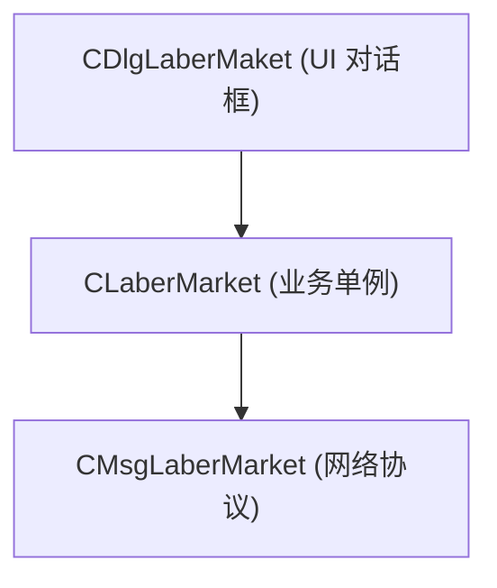

# 10: 劳务市场与打工雇佣系统设计规范 (Labor Market & Slave Hiring)

> **版本规范声明**：
> 本设计文档 100% 基于真机逆向底层动态库 `libEnvRelay.so`（符号 `CLaberMarket`, `CMsgLaberMarket`, `CDlgLaberMaket`）与客户端原版布局资产（`LaberMaket.xml`, `LaberItem.xml`, `LaberTime.xml`, `LaberWorking.xml`）及官方数据表 `MapPrison.csv`、字符串字典 `strres.ini` 真实还原，严禁任何主观臆测与硬编码。

---

## 一、系统概述与定位

### 1.1 官方系统定位
官方字符串字典（`strres.ini` ID: 400167 / 400168）明确定性：
> **【劳务市场】**
> **“打零工,得金币,练人品,混饭吃。”**

劳务市场挂靠于各府大牢系统（`MapPrison.csv` 热点 `BtnGotoLaber`），是普通玩家与家丁奴仆进行体力劳作、产出银两和积累生活技能经验的基础生产系统。

### 1.2 与武将招募的本质区别
- **职业会所（人才市场 / GDD-09）**：招募的是出战打仗、洗髓冲星的**战斗伙伴 / 武将**；
- **劳务市场（打工市场 / GDD-10）**：招募或派遣的是采矿、耕田、纺织的**劳工家丁 / 苦工**，用于挂机获取日常经济收益。

---

## 二、界面布局与工种体系（`LaberMaket.xml`）

### 2.1 界面布局架构（960x640 横屏）
- **左侧提示区**：
  - 背景框 `imgTellBck`；
  - 宣传文案 `staTell`（“打零工,得金币,练人品,混饭吃。”）；
  - 主仆关系提示 `staTellLead`（“被地主奴役中，收益需上缴 20%” 或 “收服家丁，获得额外贡金”）；
- **中间 3x2 工种选择网格**：`GridLaber`（Rect: 54, 219, 500, 320，单元模板 `LaberItem.xml`）；
  - 单个工种卡片：
    - 工种图标 `imgWork`（采矿、耕作、织锦、搬运等）；
    - 工种名称 `staTitle`；
    - 进行中标记 `ImgIsWorking`（`icon_working`）；
- **右侧工作配置面板**：
  - 未开始状态：挂载 `LaberTime.xml`（选择打工时长）；
  - 工作中状态：挂载 `LaberWorking.xml`（倒计时、元宝加速与收益领取）。

### 2.2 工种核心数据结构（`ParseJobList`）
服务端通过 JSON 动态下发 6 大工种配置：
- `id`：工种索引 ID；
- `name`：工种名称（如：采石场苦工、官办织造坊、皇家农场耕植等）；
- `icon`：工种图标资源；
- `content`：工种背景介绍；
- `require_level`：角色或家丁等级门槛；
- `gold`：每小时基础产出银两；
- `skill_exp`：每小时产出生活技能经验；
- `life_skills_name`：关联生活技能（采矿术、农耕术、纺织术等）。

---

## 三、打工时长与加速减 CD 机制（`LaberTime.xml` & `LaberWorking.xml`）

### 3.1 三阶工作时长档位（`ParseTimeSelect`）
| 档位 | 官方时长标签 | 持续秒数 (`seconds`) | 消耗费用 (`cost`) | 收益系数 | VIP 要求 |
| :--- | :--- | :--- | :--- | :--- | :--- |
| **8 小时** | `打工8小时` (`chk8`) | 28800 秒 | **免费** (0 元宝) | 1.0x 基础收益 | 无 |
| **12 小时** | `打工12小时` (`chk12`) | 43200 秒 | **10 元宝** | 1.6x 收益加成 | VIP 1 |
| **24 小时** | `打工24小时` (`chk24`) | 86400 秒 | **25 元宝** | 3.5x 收益翻倍 | VIP 2 |

### 3.2 工作中与加速逻辑（`LaberWorking.xml`）
1. **倒计时展示**：`staTime`（精确倒计时 `hh:mm:ss`）；
2. **加速减 CD 档位（`chk1`, `chk2`, `chk3`）**：
   - 加速 2 小时：消耗 5 元宝；
   - 加速 4 小时：消耗 10 元宝；
   - 立即全部完成：根据剩余小时数折算元宝；
   - 每日限制：`staTip` 显示“今天剩余加速小时：%d”；
3. **提前中止（免费）**：`staText3`（“立刻停止(免费)”，只结算已完成小时对应的收益，未完成部分作废）；
4. **工作结算领取**：点击“确定”（`btnBegin` / `Button_0`），获取产出金币（`staGold`）与生活经验（`staSkill`）。

---

## 四、底层 C++ 类与通信协议规范（`libEnvRelay.so`）

### 4.1 核心类层次结构


### 4.2 网络请求与 JSON 字段规范
通信挂载于统一网关 `POST /index.php`：

#### 1. 打开劳务市场大厅
- **Request**:
  ```http
  POST /index.php HTTP/1.1
  action=laber_market
  ```
- **Response Event**: `SHOW_JOB_PANEL`
  ```json
  {
    "code": 0,
    "role_level": 45,
    "zhupu": 0,
    "job_time": 0,
    "job_list": [
      {
        "id": 1,
        "name": "采石场劳工",
        "icon": "icon_job_mine",
        "require_level": 10,
        "gold": 2500,
        "skill_exp": 120,
        "life_skills_name": "采矿术"
      }
    ]
  }
  ```

#### 2. 开始打工派遣
- **Request**:
  ```http
  POST /index.php HTTP/1.1
  action=start&id=1&time=28800
  ```

#### 3. 加速完成或清除 CD
- **Request**:
  ```http
  POST /index.php HTTP/1.1
  action=clear_cd_ok&choice=1&flag=1
  ```
- **Response Event**: `UPDATE_COOL_DOWN_TIMER`
  ```json
  {
    "code": 0,
    "offset_time": 7200,
    "continue_add_speed_times": 3,
    "continue_speed_total_cost": 15
  }
  ```

#### 4. 结算领取奖励
- **Response**:
  ```json
  {
    "code": 0,
    "rewards": {
      "gold": 20000,
      "skills": 960
    }
  }
  ```
