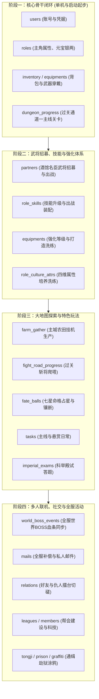

# 《大明浮生记》服务端完整数据库架构与数据字典白皮书 (Full Database Schema)

> **文档性质**：工程级全量服务端数据库与配置表设计规范  
> **服务技术栈**：`Node.js (LTS 18+)` + `Express` + `better-sqlite3`（可无缝上云迁移至 MySQL/PostgreSQL）  
> **设计目标**：完整支撑客户端 `libEnvRelay.so` 逆向得出的 **50 个 CMsg 协议模块**，涵盖从前期单机起步到后期数百人多人联机的所有数据实体。  
> **核心白皮书**：关于服务端数据权威下发、战斗推演算法与三维权责矩阵，详见顶层规划文档：[`docs/server_data_and_combat_specification.md`](file:///c:/Users/Administrator/WeChatProjects/minigame-1/docs/server_data_and_combat_specification.md)。


---

## 目录
- [一、 整体数据架构分层模型](#一-整体数据架构分层模型)
- [二、 客户端静态配置表全景（31 张 CSV/FDB 已全部就位）](#二-客户端静态配置表全景31-张-csvfdb-已全部就位)
- [三、 服务端全量动态业务表设计（DDL 完整定义与字段字典）](#三-服务端全量动态业务表设计ddl-完整定义与字段字典)
  - [3.1 账号鉴权与会话域（Auth & Session）](#31-账号鉴权与会话域auth--session)
  - [3.2 角色核心属性与养成域（Role & Attributes）](#32-角色核心属性与养成域role--attributes)
  - [3.3 武将伙伴与出战阵型域（Partners & Formations）](#33-武将伙伴与出战阵型域partners--formations)
  - [3.4 背包道具与装备锻造域（Inventory & Equipment）](#34-背包道具与装备锻造域inventory--equipment)
  - [3.5 技能绝技与强化域（Skills & Upgrades）](#35-技能绝技与强化域skills--upgrades)
  - [3.6 关卡推图、爬塔与副本域（Dungeons & Battle Progress）](#36-关卡推图爬塔与副本域dungeons--battle-progress)
  - [3.7 命格占星与宝珠系统（Fate Balls / Astrology）](#37-命格占星与宝珠系统fate-balls--astrology)
  - [3.8 主城农庄挂机与资源采集域（Farm & Gather）](#38-主城农庄挂机与资源采集域farm--gather)
  - [3.9 任务系统、悬赏与成就域（Quests & Achievements）](#39-任务系统悬赏与成就域quests--achievements)
  - [3.10 世界 BOSS 与限时活动域（World Boss & Events）](#310-世界-boss-与限时活动域world-boss--events)
  - [3.11 科举殿试答题系统（Imperial Exam）](#311-科举殿试答题系统imperial-exam)
  - [3.12 社交关系、邮件与帮会军团域（Social, Mail & League）](#312-社交关系邮件与帮会军团域social-mail--league)
  - [3.13 奇趣玩法域：通缉犯、大牢越狱与涂鸦打脸（Mini-games & Fun）](#313-奇趣玩法域通缉犯大牢越狱与涂鸦打脸mini-games--fun)
- [四、 阶段化演进实施路线图 (Phase 1 ~ Phase 4)](#四-阶段化演进实施路线图-phase-1--phase-4)

---

## 一、 整体数据架构分层模型

```text
+-----------------------------------------------------------------------------------------------+
|                                      数据架构全景模型                                           |
+-----------------------------------------------------------------------------------------------+
|                                                                                               |
|  [静态配置数据库 (Master Configs)]              [服务端动态运行时数据库 (Runtime Database)]        |
|  (只读，从 FDB/CSV 内存加载)                     (读写，SQLite / MySQL 持久化)                  |
|                                                                                               |
|  ├── 创角与外观 (CreateRoleConf/Info)           ├── 账号鉴权: users, user_sessions            |
|  ├── 战斗与站位 (BattlePos, BattleSetting)      ├── 角色武将: roles, partners, role_culture   |
|  ├── 动作音效表 (SkillAction, ArmyAction)       ├── 背包装备: inventory, equipments           |
|  ├── 新手引导表 (RookieGuideInfo)               ├── 关卡副本: dungeon_progress, fight_road    |
|  ├── 地图与城门 (MapSetting, MapGate)           ├── 技能命格: role_skills, fate_balls         |
|  ├── 道具与越狱 (ItemAction, EscapeInfo)        ├── 任务活动: tasks, exams, world_boss        |
|  └── 充值与门派 (InAppPurchase, Profession)     └── 社交帮会: mails, relations, leagues      |
|                                                                                               |
+-----------------------------------------------------------------------------------------------+
```

---

## 二、 客户端静态配置表全景（31 张 CSV/FDB 已全部就位）

位于项目 `extracted_full_resources/server_data/tables_csv/`，启动时由后端一次性加载进内存作为只读字典：

| 编号 | 表文件名 (CSV) | 核心字段 | 功能与服务职责 |
| :--- | :--- | :--- | :--- |
| **01** | `CreateRoleConf.csv` | `unIndex, unSex, strImage` | 创角外观模型映射表（男女各 20 套模型切图） |
| **02** | `CreateRoleInfo.csv` | `unType, strCfgValue` | **百家姓随机起名库**（292姓氏+348名字）与初始经历事件 |
| **03** | `BattlePos.csv` | `nIndex, nParamX, nParamY, strDesc` | **战斗九宫格站位像素坐标表**（`att1` 到 `att9`，`def1` 到 `def9`） |
| **04** | `BattleSetting.csv` | `nIndex, nParam, strDesc` | 战斗基础常量（默认动作时长 300ms、受击震颤参数） |
| **05** | `SkillAction.csv` | `unSid, unTimeAction, strAnitile, strSoundtile` | **全套技能招式动画与音效映射表**（1.7 MB 大表） |
| **06** | `ArmyAction.csv` | `unSid, unTimeAction, nX, nY, strAnitile` | 部队士兵冲锋、受击、倒地骨骼动画表（1.7 MB 大表） |
| **07** | `RookieGuideInfo.csv`| `nStep, nOpStep, strContent, strGetItemArr`| **新手村 120 步主线剧情剧本与奖励表** |
| **08** | `MapSetting.csv` | `nIndex, nParam, strDesc` | 大地图相机视口边界与平移偏移参数 |
| **09** | `MapInsideGate.csv` | `nCityId, nX, nY, strTitle` | 15 座州府城池城门城牌坐标与贴图标识 |
| **10** | `MapOutside.csv` | `nCityId, strName, nX, nY, nWidth, nHeight` | 城外过关通道、进城传送门与地图点击热区 |
| **11** | `HidePlace.csv` | `nCityId, nHideId, strName, nX, nY` | 大地图隐藏探索宝藏点配置 |
| **12** | `FieldMonsterPos.csv`| `nIndex, nParamX, nParamY, strDesc` | 野外大地图怪物刷新坐标 |
| **13** | `ItemAction.csv` | `nType, nX, nY, strSoundTitle` | 道具使用特效与音效配置 |
| **14** | `BagComboList.csv` | `unSid, nType, strShow, nSendID` | 背包下拉筛选分类配置（全部、装备、消耗、材料） |
| **15** | `EscapeInfo.csv` | `unLevel, unTime, unQuality, unNumber` | 大牢越狱挑战成功率、狱卒难度与奖励等级 |
| **16** | `MapPrison.csv` | `nId, strName, nX, nY, nWidth, nHeight` | 天牢场景布局与囚犯模型点击区域 |
| **17** | `HeadIconInfo.csv` | `unTplId, strAniTitle` | 玩家角色与 NPC 头像 GIF/PNG 贴图映射 |
| **18** | `ProfessionName.csv`| `unIndex, strProfessionName` | 门派职业定义（混混、阉派、豪杰等） |
| **19** | `InAppPurchase.csv` | `strProductID, strDesc, strReserve` | 元宝商城与充值档位表（6元60元宝等） |
| **20** | `LoadInfo.csv` | `unIndex, strInfo` | Loading 加载界面水墨竹简提示小贴士列表 |
| **21** | `Server.csv` | `uServerIdx, strName, strGameSvrIP, strGameSvrPort` | 原始服务器列表与端口分配定义 |
| **22** | `ServerTip.csv` | `unIndex, strContent` | 跑马灯滚动公告与系统提示语库 |
| **23** | `Setup.csv` | `strKey, strValue` | 引擎全局基础默认配置参数 |
| **24** | `ShieldWord.csv` | `strWord` | 聊天与起名敏感词屏蔽词库 |
| **25** | `Sound.csv` | `strSoundID, strFileName` | 游戏所有音效与 BGM 物理路径映射表 |
| **26** | `WordsOffset.csv` | `unIndex, nOffsetX, nOffsetY` | 漂字与伤害数字渲染偏移微调表 |
| **27** | `ArrowHead.csv` | `unSid, nX, nY, nWidth, nHeight, strAnitile` | 新手引导指示箭头的动态动画定义 |
| **28** | `BossesAwayInfo.csv`| `unType, strCfgValue` | 离线打工与随从外派台词库 |
| **29** | `LandFormAniOffset.csv`| `unSid, nX, nY` | 地图水墨地形动态贴图微调偏移 |
| **30** | `MapBaseAnimation.csv`| `strAnimationInfo, nX, nY, strAnitile` | 地图动态装饰物（海水、落叶、炊烟）坐标 |
| **31** | `MapBaseBuilding.csv`| `strBuildingInfo, nX, nY, nW, nH` | 主城基础功能建筑点击判定框 |

---

## 三、 服务端全量动态业务表设计（DDL 完整定义与字段字典）

以下为 SQLite / MySQL 通用的全量动态业务数据表 DDL，涵盖游戏从登录到全功能玩法的完整字段：

### 3.1 账号鉴权与会话域（Auth & Session）

```sql
-- 1. 账号主表 (CMsgLogin / 选服鉴权)
CREATE TABLE IF NOT EXISTS users (
    id INTEGER PRIMARY KEY AUTOINCREMENT,
    username VARCHAR(64) UNIQUE NOT NULL,    -- 登录用户名
    password_hash VARCHAR(128) NOT NULL,    -- 密码哈希
    client_id VARCHAR(64) DEFAULT '',       -- 客户端硬件唯一标识
    token VARCHAR(64) DEFAULT '',           -- 登录凭证令牌 (offline_token_xxx)
    status INTEGER DEFAULT 1,               -- 账号状态 (1:正常, 0:封禁)
    last_login_ip VARCHAR(45) DEFAULT '',   -- 上次登录IP
    last_login_at DATETIME DEFAULT CURRENT_TIMESTAMP,
    created_at DATETIME DEFAULT CURRENT_TIMESTAMP
);

-- 2. 账号会话与设备表
CREATE TABLE IF NOT EXISTS user_sessions (
    id INTEGER PRIMARY KEY AUTOINCREMENT,
    user_id INTEGER NOT NULL,
    session_id VARCHAR(64) UNIQUE NOT NULL, -- 对应回包中的 PHPSESSID
    server_id INTEGER DEFAULT 1,            -- 当前登录区服ID
    socket_fd INTEGER DEFAULT -1,           -- 对应的 TCP 网关 8008 连接句柄
    is_online INTEGER DEFAULT 1,            -- 在线状态
    heartbeat_at DATETIME DEFAULT CURRENT_TIMESTAMP,
    FOREIGN KEY(user_id) REFERENCES users(id)
);
```

### 3.2 角色核心属性与养成域（Role & Attributes）

```sql
-- 3. 玩家角色主表 (CMsgRole, CMsgLogin)
CREATE TABLE IF NOT EXISTS roles (
    id INTEGER PRIMARY KEY AUTOINCREMENT,   -- 角色ID (例如 10001)
    user_id INTEGER NOT NULL,               -- 关联账号
    player_name VARCHAR(32) NOT NULL,       -- 角色姓名 (大明天子)
    sex INTEGER DEFAULT 1,                  -- 性别 (1:男, 0:女)
    tpl_id INTEGER DEFAULT 1,               -- 创角形象模型ID (对应 CreateRoleConf)
    level INTEGER DEFAULT 1,                -- 当前等级
    exp BIGINT DEFAULT 0,                   -- 当前角色经验值
    gold INTEGER DEFAULT 9999,              -- 元宝 (付费货币)
    silver BIGINT DEFAULT 99999,            -- 银两 (游戏内基础金币)
    vip_level INTEGER DEFAULT 0,            -- VIP 等级
    vip_exp INTEGER DEFAULT 0,              -- VIP 累积积分
    city_id INTEGER DEFAULT 1,              -- 当前所处州府城市 (1:北京/洛阳, 6:新手村, 8:广州)
    role_state INTEGER DEFAULT 1,           -- 状态机标志位
    help_step INTEGER DEFAULT 1,            -- 新手引导步进 (99表示已全部毕业)
    official_rank INTEGER DEFAULT 0,        -- 官职爵位 (九品芝麻官至一品大员)
    combat_force INTEGER DEFAULT 100,       -- 角色综合总战力评估
    salary_taken_today INTEGER DEFAULT 0,   -- 今日是否已领取朝廷俸禄
    online_time_today INTEGER DEFAULT 0,    -- 今日累积在线时长 (秒)
    created_at DATETIME DEFAULT CURRENT_TIMESTAMP,
    updated_at DATETIME DEFAULT CURRENT_TIMESTAMP,
    FOREIGN KEY(user_id) REFERENCES users(id)
);

-- 4. 属性培养/洗练暂存表 (CMsgAttrCulture)
CREATE TABLE IF NOT EXISTS role_culture_attrs (
    role_id INTEGER PRIMARY KEY,
    str_base INTEGER DEFAULT 10,            -- 基础力量 (影响物理攻击)
    agi_base INTEGER DEFAULT 10,            -- 基础敏捷 (影响先手速度与闪避)
    int_base INTEGER DEFAULT 10,            -- 基础智力 (影响绝技策攻与暴击)
    con_base INTEGER DEFAULT 10,            -- 基础体质 (影响最大生命值上限)
    str_culture INTEGER DEFAULT 0,          -- 培养累积力量加成
    agi_culture INTEGER DEFAULT 0,          -- 培养累积敏捷加成
    int_culture INTEGER DEFAULT 0,          -- 培养累积智力加成
    con_culture INTEGER DEFAULT 0,          -- 培养累积体质加成
    temp_str INTEGER DEFAULT 0,             -- 未确认的临时洗练属性 (等待玩家选择保留或放弃)
    temp_agi INTEGER DEFAULT 0,
    temp_int INTEGER DEFAULT 0,
    temp_con INTEGER DEFAULT 0,
    FOREIGN KEY(role_id) REFERENCES roles(id)
);
```

### 3.3 武将伙伴与出战阵型域（Partners & Formations）

```sql
-- 5. 招募武将伙伴表 (CMsgLaberMarket, CMsgPartnerWarehouse)
CREATE TABLE IF NOT EXISTS partners (
    id INTEGER PRIMARY KEY AUTOINCREMENT,   -- 武将唯一实例ID
    role_id INTEGER NOT NULL,               -- 所属主公
    hero_tpl_id INTEGER NOT NULL,           -- 武将模板ID (如徐达、常遇春、小翠)
    name VARCHAR(32) NOT NULL,              -- 武将名
    quality INTEGER DEFAULT 1,              -- 品质 (1:绿, 2:蓝, 3:紫, 4:橙)
    level INTEGER DEFAULT 1,
    exp BIGINT DEFAULT 0,
    is_deploy INTEGER DEFAULT 0,            -- 是否出战 (1:出战阵容, 0:在仓库)
    battle_pos INTEGER DEFAULT 0,           -- 站位编号 (1~9号位，对应 BattlePos.csv)
    str_val INTEGER DEFAULT 20,
    agi_val INTEGER DEFAULT 20,
    int_val INTEGER DEFAULT 20,
    con_val INTEGER DEFAULT 20,
    created_at DATETIME DEFAULT CURRENT_TIMESTAMP,
    FOREIGN KEY(role_id) REFERENCES roles(id)
);
```

### 3.4 背包道具与装备锻造域（Inventory & Equipment）

```sql
-- 6. 道具背包基础表 (CMsgItem)
CREATE TABLE IF NOT EXISTS inventory (
    id INTEGER PRIMARY KEY AUTOINCREMENT,
    role_id INTEGER NOT NULL,
    item_id INTEGER NOT NULL,               -- 物品模板配置ID
    item_count INTEGER DEFAULT 1,           -- 堆叠数量
    bag_pos INTEGER NOT NULL,               -- 背包格子索引 (0~47)
    item_type INTEGER DEFAULT 1,            -- 1:装备, 2:消耗品, 3:图纸材料, 4:命格
    is_bind INTEGER DEFAULT 1,              -- 是否绑定
    created_at DATETIME DEFAULT CURRENT_TIMESTAMP,
    FOREIGN KEY(role_id) REFERENCES roles(id)
);

-- 7. 装备专属实例与强化表 (CMsgEquipStrengthen, CMsgEquipTrans)
CREATE TABLE IF NOT EXISTS equipments (
    id INTEGER PRIMARY KEY AUTOINCREMENT,   -- 装备唯一编码
    role_id INTEGER NOT NULL,
    equip_tpl_id INTEGER NOT NULL,          -- 装备基础模板ID (如 1002 晾衣杆)
    slot_type VARCHAR(16) NOT NULL,         -- 装备部位: weapon, armor, belt, shoes, ring, necklace
    equipped_role_id INTEGER DEFAULT 0,     -- 穿戴在谁身上 (0:在背包, 10001:主角, 其他:武将ID)
    strengthen_level INTEGER DEFAULT 0,     -- 强化等级 (+0 到 +12)
    base_atk INTEGER DEFAULT 0,             -- 基础攻击附加
    base_def INTEGER DEFAULT 0,             -- 基础防御附加
    base_hp INTEGER DEFAULT 0,              -- 基础生命附加
    extra_attrs TEXT DEFAULT '{}',          -- 重铸/转换洗练词条 JSON
    gem_slots TEXT DEFAULT '[]',            -- 宝石镶嵌槽位 JSON
    created_at DATETIME DEFAULT CURRENT_TIMESTAMP,
    FOREIGN KEY(role_id) REFERENCES roles(id)
);
```

### 3.5 技能绝技与强化域（Skills & Upgrades）

```sql
-- 8. 角色技能学习装配表 (CMsgSkill)
CREATE TABLE IF NOT EXISTS role_skills (
    id INTEGER PRIMARY KEY AUTOINCREMENT,
    role_id INTEGER NOT NULL,
    target_role_id INTEGER NOT NULL,        -- 谁学的 (主角或指定武将)
    skill_id INTEGER NOT NULL,              -- 技能ID
    skill_level INTEGER DEFAULT 1,          -- 技能等级
    skill_type INTEGER DEFAULT 1,           -- 1:主动绝技, 2:被动光环
    is_equipped INTEGER DEFAULT 1,          -- 是否挂载出战 (战斗时有概率释放)
    slot_index INTEGER DEFAULT 1,           -- 技能槽编号
    FOREIGN KEY(role_id) REFERENCES roles(id)
);
```

### 3.6 关卡推图、爬塔与副本域（Dungeons & Battle Progress）

```sql
-- 9. 主线关卡与过关通道进度表 (CMsgBattle, CMsgMap)
CREATE TABLE IF NOT EXISTS dungeon_progress (
    role_id INTEGER NOT NULL,
    dungeon_id INTEGER NOT NULL,            -- 关卡ID (例如 1:新手过关通道一)
    city_id INTEGER NOT NULL,               -- 所属州府城市
    star_level INTEGER DEFAULT 3,           -- 通关评价星级 (1~3星)
    pass_times INTEGER DEFAULT 1,           -- 累计通关次数
    best_rounds INTEGER DEFAULT 1,          -- 历史最优击杀回合数
    is_hidden_unlocked INTEGER DEFAULT 0,   -- 是否解锁对应的隐藏副本
    last_passed_at DATETIME DEFAULT CURRENT_TIMESTAMP,
    PRIMARY KEY(role_id, dungeon_id),
    FOREIGN KEY(role_id) REFERENCES roles(id)
);

-- 10. 过关斩将爬塔挑战记录 (CMsgBattle::SendFightRoad)
CREATE TABLE IF NOT EXISTS fight_road_progress (
    role_id INTEGER PRIMARY KEY,
    current_floor INTEGER DEFAULT 1,        -- 当前挑战层数
    max_floor INTEGER DEFAULT 1,            -- 历史最高通关层数
    daily_reset_times INTEGER DEFAULT 1,    -- 今日重置剩余次数
    last_challenge_at DATETIME DEFAULT CURRENT_TIMESTAMP,
    FOREIGN KEY(role_id) REFERENCES roles(id)
);
-- 10.1 关卡怪物模板与属性表 (Combat Engine 数据源)
CREATE TABLE IF NOT EXISTS dungeon_monsters (
    monster_id INTEGER PRIMARY KEY,         -- 怪物全局唯一模板ID
    name VARCHAR(64) NOT NULL,              -- 怪物显示名称 (如 市井流氓, 恶霸头目)
    level INTEGER DEFAULT 1,                -- 怪物等级
    caty INTEGER DEFAULT 1000,              -- 门派职业: 1000混混, 1001攻将, 1002防将, 1003阉派
    swf VARCHAR(128) NOT NULL,              -- 怪物形象贴图与动画路径
    max_hp INTEGER NOT NULL,                -- 最大气血上限
    mp INTEGER DEFAULT 50,                  -- 初始气力值
    melee INTEGER DEFAULT 0,                -- 物理攻击
    magic INTEGER DEFAULT 0,                -- 法术攻击
    defend INTEGER DEFAULT 0,               -- 物理防御
    magic_def INTEGER DEFAULT 0,            -- 法术防御
    speed INTEGER DEFAULT 10,               -- 出手速度 (决定全场先手顺序)
    hit INTEGER DEFAULT 95,                 -- 命中率基础值
    dodge INTEGER DEFAULT 5,                -- 闪避率基础值
    cri INTEGER DEFAULT 5,                  -- 暴击率基础值
    used_skills TEXT DEFAULT '[]'           -- 配置出战技能ID数组 JSON (最多3个, 选自官方34个技能池)
);

-- 10.2 副本关卡波次与怪物站位表
CREATE TABLE IF NOT EXISTS dungeon_stages (
    id INTEGER PRIMARY KEY AUTOINCREMENT,
    dungeon_id INTEGER NOT NULL,            -- 关卡ID (如 0 代表广州新手村通道)
    stage_wave INTEGER DEFAULT 1,           -- 关卡波次/小节 (如 1, 2, 3)
    formation_pos INTEGER NOT NULL,         -- 九宫格守方阵位 def1~def6 (1~6)
    monster_id INTEGER NOT NULL,            -- 关联 dungeon_monsters.monster_id
    reward_exp INTEGER DEFAULT 50,          -- 通关掉落基础经验
    reward_gold INTEGER DEFAULT 100,        -- 通关掉落银两
    reward_merit INTEGER DEFAULT 20,        -- 通关掉落战功
    reward_drops TEXT DEFAULT '[]',         -- 掉落物品池 (装备/宝石模版ID与概率 JSON)
    FOREIGN KEY(monster_id) REFERENCES dungeon_monsters(monster_id)
);
```

### 3.7 命格占星与宝珠系统（Fate Balls / Astrology）

```sql
-- 11. 七星命格宝珠背包与镶嵌表 (CMsgMakeBall)
CREATE TABLE IF NOT EXISTS fate_balls (
    id INTEGER PRIMARY KEY AUTOINCREMENT,   -- 宝珠实例ID
    role_id INTEGER NOT NULL,
    ball_tpl_id INTEGER NOT NULL,           -- 命格配置ID (如贪狼、破军、七杀)
    quality INTEGER DEFAULT 1,              -- 品质 (绿/蓝/紫/橙/金)
    level INTEGER DEFAULT 1,                -- 命格等级
    exp INTEGER DEFAULT 0,                  -- 命格升级经验 (吞噬其他宝珠增长)
    equipped_target_id INTEGER DEFAULT 0,   -- 镶嵌在谁身上 (0:在命格背包)
    slot_index INTEGER DEFAULT 0,           -- 命盘 8 槽位编号 (1~8)
    created_at DATETIME DEFAULT CURRENT_TIMESTAMP,
    FOREIGN KEY(role_id) REFERENCES roles(id)
);

-- 12. 玩家占星师解锁状态表
CREATE TABLE IF NOT EXISTS astrology_states (
    role_id INTEGER PRIMARY KEY,
    current_master_level INTEGER DEFAULT 1, -- 当前点亮的占星师 (1~5级術士，逐级解锁高级命格)
    daily_astrology_count INTEGER DEFAULT 0,
    last_astrology_at DATETIME DEFAULT CURRENT_TIMESTAMP,
    FOREIGN KEY(role_id) REFERENCES roles(id)
);
```

### 3.8 主城农庄挂机与资源采集域（Farm & Gather）

```sql
-- 13. 主城农田与资源挂机生产表 (CMsgGather)
CREATE TABLE IF NOT EXISTS farm_gather (
    id INTEGER PRIMARY KEY AUTOINCREMENT,
    role_id INTEGER NOT NULL,
    field_id INTEGER NOT NULL,              -- 土地格子编号 (1~6块地)
    crop_type INTEGER DEFAULT 1,            -- 种植资源类型 (1:银两, 2:粮草, 3:精铁)
    status INTEGER DEFAULT 0,               -- 0:空闲, 1:生长中, 2:已成熟可收割
    plant_at DATETIME DEFAULT CURRENT_TIMESTAMP,
    harvest_at DATETIME NOT NULL,           -- 预定成熟时间点 (可被元宝秒CD)
    FOREIGN KEY(role_id) REFERENCES roles(id)
);
```

### 3.9 任务系统、悬赏与成就域（Quests & Achievements）

```sql
-- 14. 任务状态追踪表 (CMsgTask)
CREATE TABLE IF NOT EXISTS tasks (
    role_id INTEGER NOT NULL,
    task_id INTEGER NOT NULL,               -- 任务ID
    task_type INTEGER DEFAULT 1,            -- 1:主线任务, 2:日常任务, 3:悬赏任务
    state INTEGER DEFAULT 1,                -- 0:可接, 1:进行中, 2:已完成未领奖, 3:已交付结案
    progress_cur INTEGER DEFAULT 0,         -- 当前进度 (如杀怪 3/5)
    progress_target INTEGER DEFAULT 1,      -- 目标总要求
    accepted_at DATETIME DEFAULT CURRENT_TIMESTAMP,
    finished_at DATETIME,
    PRIMARY KEY(role_id, task_id),
    FOREIGN KEY(role_id) REFERENCES roles(id)
);

-- 15. 个人成就徽章达成记录 (CMsgAchiev)
CREATE TABLE IF NOT EXISTS achievements (
    role_id INTEGER NOT NULL,
    achiev_id INTEGER NOT NULL,             -- 成就编号
    is_completed INTEGER DEFAULT 0,         -- 是否达成
    is_reward_taken INTEGER DEFAULT 0,      -- 属性加成/奖励是否已领取
    completed_at DATETIME,
    PRIMARY KEY(role_id, achiev_id),
    FOREIGN KEY(role_id) REFERENCES roles(id)
);
```

### 3.10 世界 BOSS 与限时活动域（World Boss & Events）

```sql
-- 16. 全服世界 BOSS 当前战局总控表 (CMsgBattleBoss)
CREATE TABLE IF NOT EXISTS world_boss_events (
    id INTEGER PRIMARY KEY AUTOINCREMENT,
    boss_tpl_id INTEGER DEFAULT 1,          -- BOSS 模板ID
    boss_name VARCHAR(32) DEFAULT '极恶首领',
    max_hp BIGINT NOT NULL,                 -- BOSS 最大总生命值 (如 10,000,000)
    cur_hp BIGINT NOT NULL,                 -- 当前剩余生命值
    is_alive INTEGER DEFAULT 1,             -- 是否存活
    killer_role_id INTEGER DEFAULT 0,       -- 终结击杀者角色ID
    opened_at DATETIME DEFAULT CURRENT_TIMESTAMP,
    killed_at DATETIME
);

-- 17. 玩家在世界 BOSS 中的伤害战功与鼓舞榜
CREATE TABLE IF NOT EXISTS boss_damage_rank (
    event_id INTEGER NOT NULL,              -- 关联世界 BOSS 战局
    role_id INTEGER NOT NULL,
    damage_total BIGINT DEFAULT 0,          -- 累积打掉的伤害数值
    inspire_level INTEGER DEFAULT 0,        -- 元宝/银两战力鼓舞层数 (每层+10%攻击)
    cool_down_until DATETIME,               -- 挑战复活冷却时间
    is_reward_claimed INTEGER DEFAULT 0,    -- 排名奖励是否已领
    PRIMARY KEY(event_id, role_id),
    FOREIGN KEY(role_id) REFERENCES roles(id)
);
```

### 3.11 科举殿试答题系统（Imperial Exam）

```sql
-- 18. 科举答题进度与状元积分表 (CMsgExam)
CREATE TABLE IF NOT EXISTS imperial_exams (
    role_id INTEGER NOT NULL,
    exam_date DATE NOT NULL,                -- 答题日期 (YYYY-MM-DD)
    current_question_idx INTEGER DEFAULT 1, -- 当前做到了第几题 (共 10 题)
    correct_count INTEGER DEFAULT 0,        -- 累计答对题数
    points_total INTEGER DEFAULT 0,         -- 考取功名累计积分
    is_double_active INTEGER DEFAULT 0,     -- 是否激活了双倍积分卡
    last_answered_at DATETIME,
    PRIMARY KEY(role_id, exam_date),
    FOREIGN KEY(role_id) REFERENCES roles(id)
);
```

### 3.12 社交关系、邮件与帮会军团域（Social, Mail & League）

```sql
-- 19. 全服与个人邮箱系统 (CMsgMail)
CREATE TABLE IF NOT EXISTS mails (
    id INTEGER PRIMARY KEY AUTOINCREMENT,
    receiver_role_id INTEGER NOT NULL,      -- 接收者 (0表示全服广播系统邮件)
    sender_name VARCHAR(32) DEFAULT '朝廷通谕',
    title VARCHAR(64) NOT NULL,
    content TEXT NOT NULL,
    attachments TEXT DEFAULT '[]',          -- 附件道具与货币 JSON: [{"type":"silver","count":5000}]
    is_read INTEGER DEFAULT 0,              -- 是否已查阅
    is_taken INTEGER DEFAULT 0,             -- 附件是否已提取
    sent_at DATETIME DEFAULT CURRENT_TIMESTAMP,
    expire_at DATETIME                      -- 邮件逾期自动销毁时间点
);

-- 20. 好友与仇人关系链表 (CMsgRelation)
CREATE TABLE IF NOT EXISTS relations (
    role_id INTEGER NOT NULL,
    target_role_id INTEGER NOT NULL,
    relation_type INTEGER NOT NULL,         -- 1:好友, 2:仇人, 3:黑名单
    intimacy INTEGER DEFAULT 0,             -- 好友亲密度
    created_at DATETIME DEFAULT CURRENT_TIMESTAMP,
    PRIMARY KEY(role_id, target_role_id, relation_type),
    FOREIGN KEY(role_id) REFERENCES roles(id)
);

-- 21. 帮会/军团公会主表 (CMsgLeague)
CREATE TABLE IF NOT EXISTS leagues (
    id INTEGER PRIMARY KEY AUTOINCREMENT,
    league_name VARCHAR(32) UNIQUE NOT NULL,
    leader_role_id INTEGER NOT NULL,        -- 帮主角色ID
    level INTEGER DEFAULT 1,                -- 帮会等级
    capital BIGINT DEFAULT 0,               -- 帮会总资金 (帮众捐献银两累积)
    announcement TEXT DEFAULT '同心协力，共图大业！',
    member_count INTEGER DEFAULT 1,
    created_at DATETIME DEFAULT CURRENT_TIMESTAMP
);

-- 22. 帮会成员映射表
CREATE TABLE IF NOT EXISTS league_members (
    league_id INTEGER NOT NULL,
    role_id INTEGER NOT NULL,
    duty_type INTEGER DEFAULT 1,            -- 1:普通帮众, 2:堂主, 3:副帮主, 4:帮主
    contribution_total BIGINT DEFAULT 0,    -- 历史总贡献
    joined_at DATETIME DEFAULT CURRENT_TIMESTAMP,
    PRIMARY KEY(league_id, role_id),
    FOREIGN KEY(league_id) REFERENCES leagues(id),
    FOREIGN KEY(role_id) REFERENCES roles(id)
);
```

### 3.13 奇趣玩法域：通缉犯、大牢越狱与涂鸦打脸（Mini-games & Fun）

```sql
-- 23. 官府通缉令追凶表 (CMsgTongji)
CREATE TABLE IF NOT EXISTS tongji_criminals (
    id INTEGER PRIMARY KEY AUTOINCREMENT,
    role_id INTEGER NOT NULL,               -- 哪个玩家接的榜
    criminal_id INTEGER NOT NULL,           -- 逃犯编号
    difficulty INTEGER DEFAULT 1,           -- 危险系数 (1~5星)
    status INTEGER DEFAULT 1,               -- 1:通缉中, 2:缉拿归案, 3:逃脱
    reward_merit INTEGER DEFAULT 50,        -- 朝廷功勋
    reward_silver INTEGER DEFAULT 1000,
    created_at DATETIME DEFAULT CURRENT_TIMESTAMP,
    FOREIGN KEY(role_id) REFERENCES roles(id)
);

-- 24. 大牢收监与越狱记录 (CMsgPrison)
CREATE TABLE IF NOT EXISTS prison_records (
    role_id INTEGER PRIMARY KEY,
    in_prison INTEGER DEFAULT 0,            -- 1:关押在天牢, 0:自由身
    sentence_seconds INTEGER DEFAULT 0,     -- 剩余服刑秒数
    bail_gold INTEGER DEFAULT 50,           -- 赎身出狱所需元宝
    enter_prison_at DATETIME,
    FOREIGN KEY(role_id) REFERENCES roles(id)
);

-- 25. 城墙涂鸦墨宝留言板 (CMsgGraffiti)
CREATE TABLE IF NOT EXISTS graffiti_walls (
    id INTEGER PRIMARY KEY AUTOINCREMENT,
    city_id INTEGER NOT NULL,               -- 哪个城市的城门
    author_role_id INTEGER NOT NULL,
    author_name VARCHAR(32) NOT NULL,
    content VARCHAR(120) NOT NULL,          -- 留言骚话
    ink_color VARCHAR(16) DEFAULT '#ffffff',
    praise_count INTEGER DEFAULT 0,         -- 玩家点赞瞻仰数
    created_at DATETIME DEFAULT CURRENT_TIMESTAMP
);

-- 26. 掌掴恶搞与厚脸皮记录 (CMsgCheeky)
CREATE TABLE IF NOT EXISTS cheeky_records (
    target_role_id INTEGER PRIMARY KEY,
    slap_count INTEGER DEFAULT 0,           -- 被其他玩家掌掴扇耳光的总次数
    current_title VARCHAR(32) DEFAULT '脸皮薄如纸', -- 随被扇次数解锁的搞笑称号 (如城墙拐弯)
    last_slapped_at DATETIME
);
```

---

## 四、 阶段化演进实施路线图 (Phase 1 ~ Phase 4)

为了在编码落地时不失控，我们将上述 26 张表按照开发优先级分为四个阶段逐步点亮：



* **实施原则**：每进入一个阶段，只需在 `src/db/schema.sql` 中启用该阶段对应的表 DDL，并挂载对应的 CMsg 路由，即可平滑构建出完整的单机/多人服务端。
